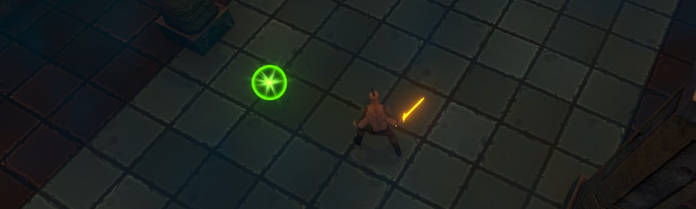

# The HealthPickup Class
{: .no_toc }
The HealthPickup class is used to control the generation of health pickups.



---
<h2 class="text-delta">Contents</h2>
1. TOC
{:toc}
---

## Placing a Health Pickup in the World
In the base project, you can find the Health Pickup prefab under `Assets > Assets to Use > HealthPickup`. 

Drag this prefab into the environment and place it where you want it. Note that by default though, health globes will disappear shortly after their creation. If you want to adjust this setting, in the heirarchy, select the Game manager, and expand the `Settings` foldout on the `GameManager` component. Then expand the `Health Globe Values` foldout to see health globe settings.


## Spawning an Health Pickup
```csharp
// Spawn a Health Pickup at the position of the player.
HealthPickup.Spawn(GameManager.player.transform.position);
```

## Destroying an Health Pickup
Health Pickups are standard prefabs of standard Unity GameObjects. To Destroy an HealthPickup object, just call `Destroy()` with the GameObject as a parameter.