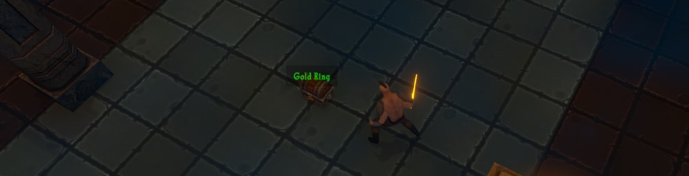

# The ItemPickup Class
{: .no_toc }
The ItemPickup class is used to control the generation of item pickups.

{: .note }
You are not required to write any code in this unit. It is recommended that you instead use the provided visual scripting system in this unit. If you want to implement logic that cannot easily be handled by that system though, this documentation should help you better understand the code and classes in the project.



---
<h2 class="text-delta">Contents</h2>
1. TOC
{:toc}
---

## Placing an Item Pickup in the World
In the base project, you can find the Item Pickup prefab under `Assets > Assets to Use > ItemPickup`. 

Drag this prefab into the environment and place it where you want it. In the inspector, you can then choose to either specify a specific item for the pickup, or the intended rarity for the randomised item.

## Spawning an Item Pickup
```csharp
// Items are scriptable objects. If you expose the item variable in the inspector,
// you can select the item template you want to use.
public Item itemToSpawn;

// Spawn an item pickup containing the specified item.
ItemPickup.Spawn(spawnLocation, itemToSpawn);

// Spawn an item pickup containing a random item of the specified rarity.
ItemPickup.Spawn(spawnLocation, Item.ItemRarity.Common);
ItemPickup.Spawn(spawnLocation, Item.ItemRarity.Rare);
ItemPickup.Spawn(spawnLocation, Item.ItemRarity.Legendary);
```

## Destroying an Item Pickup
Item Pickups are standard prefabs of standard Unity GameObjects. To Destroy an ItemPickup object, just call `Destroy()` with the GameObject as a parameter.