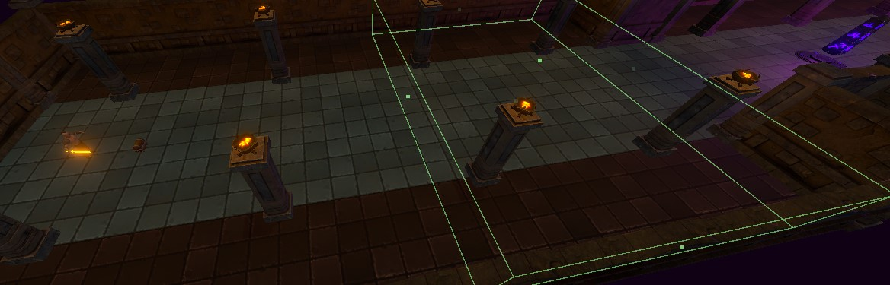

# Changing the Controls
In this page, you will learn about some of the common ways to manipulate the balance of your game.

---
<h2 class="text-delta">Contents</h2>
1. TOC
{:toc}
---

## Updating Monster Attributes
To update monster attributes, go to the `Assets to Use > Monsters` folder. Select any of the monsters in this folder, and then go to the `Monster` component in the inspector. At the top of the component, you will see a variety of values you can change here. These control all major aspects of the monster's attributes, such as:

1. **Damage**: The damage done by the monsters. All monster attacks will deal damage as a modifier of this (e.g., a big attack may deal 200% of their base damage).
1. **Health**: The *maximum* amount of health that the monster will have.
1. **Resource**: The *maximum* amount of resource that the monster will have. This only matters if the monster will be consuming resources for attacks. 
1. **Movement Speed**: Controls how quickly the monster will move.
1. **Base Armor**: Controls how much armor the monster will have. The effect of armor will be determined by the **damage formula** that you personally implement for your experience.
1. **Base Critical Strike Chance**: Determines the critical strike chance for the unit, as a percentage (e.g., 0.1 = 10% critical chance).
1. **Base Critical Strike Damage**: Determines the **bonus** damage when the monster scores a critical hit, as a percentage (e.g., 0.5 = 50% additional damage on each critical).
1. **Base Health Regen**: The amount of health that the monster will regenerate per second.
1. **Base Resource Regen**: The amount of resource that the monster will regenerate per second.
1. **Base Attack Range**: The melee attack range of the unit. Larger units should have a bigger attack range.

Additionally, you can also choose the abilities that every monster will have. The melee monsters in the base project come with a default `Slash` ability, and the ranged monster comes with a `Shoot` ability. If you want to make monsters have more overall variety, you can add additional abilities here by adding them into the ability list.

### Example: Adding an Ability

{: .highlight }
Try to make one of the monsters more interesting. Select `Monster 3` (the **Skeleton Executioner**) and add the `Charge` ability to its ability list. The monster will now use this ability to charge towards the player (this also highlights that you can save some work by having monsters and the player even use the same ability!).

## Updating Player Attributes
The player uses many of the same attributes as the monsters. You can select the player characters from the scene heirarchy.

All of the monster attributes you found on the monster, such as damage and movement speed, can also be found on the Player component (as they both inherit from the `Unit` script).

Additionally, the player also has several options for **scaling**, which can be found at the bottom of the Player class. These are the *additional* attributes that the player will gain every time they gain a level.

## Updating Monster Spawning
Rather than placing monsters manually into the level, the game will *automatically* spawn monsters with appropriate spawn effects as the player enters certain areas. It does this using invisible spawn boxes placed in each of the example level tiles.

The *first* time a player walks into a spawner box, it will spawn some monsters. The amount of monsters, as well as the type of monsters, is controlled in two places.

