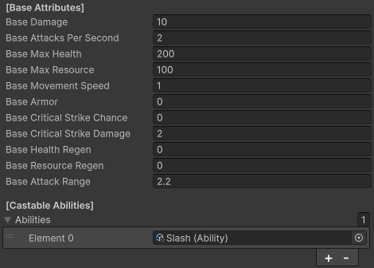
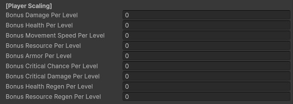
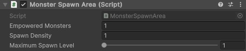
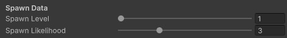

# Balancing
{: .no_toc }
In this page, you will learn about some of the common ways to manipulate the balance of your game.

---
<h2 class="text-delta">Contents</h2>
1. TOC
{:toc}
---

## Updating Monster Attributes
To update monster attributes, go to the `Assets to Use > Monsters` folder. Select any of the monsters in this folder, and then go to the `Monster` component in the inspector. At the top of the component, you will see a variety of values you can change here. These control all major aspects of the monster's attributes.

{: .highlight }
> 

> 
Attribute Description Summary

> 
> Here is a brief description for each of the main attributes for a monster:
>
> - **Damage**: The damage done by the monsters. All monster attacks will deal damage as a modifier of this (e.g., a big attack may deal 200% of their base damage).
>
> - **Health**: The *maximum* amount of health that the monster will have.
>
> - **Resource**: The *maximum* amount of resource that the monster will have. This only matters if the monster will be consuming resources for attacks.
> 
> - **Movement Speed**: Controls how quickly the monster will move.
>
> - **Base Armor**: Controls how much armor the monster will have. The effect of armor will be determined by the **damage formula** that you personally implement for your experience.
>
> - **Base Critical Strike Chance**: Determines the critical strike chance for the unit, as a percentage (e.g., 0.1 = 10% critical chance).
>
> - **Base Critical Strike Damage**: Determines the **bonus** damage when the monster scores a critical hit, as a percentage (e.g., 0.5 = 50% additional damage on each critical).
>
> - **Base Health Regen**: The amount of health that the monster will regenerate per second.
>
> - **Base Resource Regen**: The amount of resource that the monster will regenerate per second.
>
> - **Base Attack Range**: The melee attack range of the unit. Larger units should have a bigger attack range.
> 
> - **Abilities**: The list of abilities the monsters can cast. The default monsters come with a basic `Slash` ability for melee monsters, and a `Shoot` ability for ranged monsters. 
> 

## Updating Player Attributes
The player uses many of the same attributes as the monsters. You can select the player characters from the scene heirarchy.

All of the monster attributes you found on the monster, such as damage and movement speed, can also be found on the Player component (as they both inherit from the `Unit` script).

Additionally, the player also has several options for **scaling**, which can be found at the bottom of the Player class. These are the *additional* attributes that the player will gain every time they gain a level.

## Updating Monster Spawning
Rather than placing monsters manually into the level, the game can *automatically* spawn monsters with appropriate spawn effects as the player enters certain areas. It does this using invisible spawn boxes placed in each of the example level tiles.

These spawn boxes are already included in all of the example tiles, and can be found by expanding the tile and selecting the `SpawnArea` GameObjects.

If you want to set up your own spawn areas, each spawn area just needs to have a box collider with `isTrigger` set to True, and a SpawnArea component.

### Controlling the Amount of Monsters Spawned
The amount of monsters spawned by spawn boxes is determined by the **spawn density** of your game. You can adjust the global spawn density by selecting the `GameManager`, and going to the `MonsterSpawnManager` component. By default, the spawn density is set to 1. This is a multiplicative modifier which will affect all spawn boxes. Setting this value to 2 will spawn twice as many monsters.

You can also specify the types of enemies which can be spawned by the spawn areas here. Only monsters included in the "Monsters To Spawn" list will be considered.

If you want to change the spawn density for a particular box (e.g., you want it to be a difficult area which spawns twice as many enemies), you can also adjust the spawn density for a specific spawn area by modifying the `Spawn Density` value on that specific `SpawnArea` component.

{: .important-title }
> Empowered Monsters
>
> This describes the total number of empowered monsters which will spawn. E.g., a value of 1 will spawn exactly one empowered monster in that area.

{: .important-title }
> Spawn Density
>
> This is a modifier which affects the density of this specific spawn area. Specifying a value of 2 here would cause the spawn area to cause twice as many monsters as a value of 1 (but only for this exact spawner).

{: .important-title }
> Empowered Monsters
>
> This describes the total number of empowered monsters which will spawn. E.g., a value of 1 will spawn exactly one empowered monster in that area.

### Advanced Spawning Logic
You can also change how likely a specific monster is to spawn, and the types of monsters each spawner can spawn, by adjusting the properties on each monster.

Select a monster in your game (monsters are found in `Assets to Use > Monsters`). Go to the Monster component, and scroll to the bottom. You will find a header for 'Spawn Data'.

{: .important-title }
> Spawn Level
>
> The **spawn level** specified on the monster is used by the spawners to control what types of monsters it can spawn. On the `SpawnArea` component, you can select a maximum monster level that the spawner will spawn. For example, a spawner with a maximum spawn level of 5 would not be able to spawn a monster that you've set to level 7 here.

{: .important-title }
> Spawn Likelihood
>
> The **spawn likelihood** determines how likely the monster is to spawn. If one monster hasd a spawn likelihood of 1, and another has a spawn likelihood of 3, the second monster will spawn three times as often. Note that this does not change the total number of monsters that get spawned, but just the distribution of their types.

