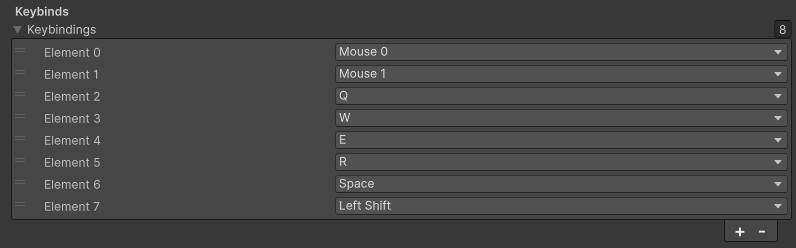
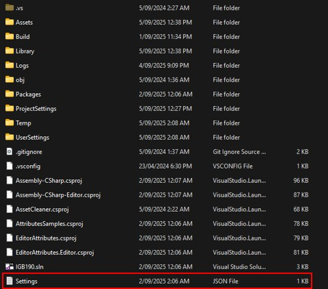
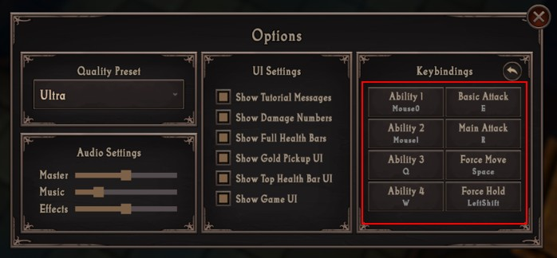

# Changing the Controls
{: .no_toc }
In this guide, you will learn how to change the controls for the experience.

---
<h2 class="text-delta">Contents</h2>
1. TOC
{:toc}
---

## Control Flexibility
While the experience allows you to adjust the default keybinds of the game, you should avoid making fundamental adjustments to the control scheme (such as changing to WSAD movement or overhauling the perspective of the camera). You are being tasked to work on very specific parts of the project (as part of a larger fictional game studio) and making broad adjustments to this would be outside the scope of the work they have assigned to you. 

## Default Controls
You can change the **default controls** by selecting the `GameManager` in the scene heirarchy and going to the `Settings` foldout. This contains some basic properties for the game, such as audio volume, and UI settings. At the bottom of this window, however, you will find the Keybinds for the game.

The Settings script details which keybind corresponds with each ability slot, but this is not intuitive to control via the inspector, so the exact mappings are:

- **Element 0**: This is the keybind for the first ability in the Player's ability list.
- **Element 1**: This is the keybind for the second ability in the Player's ability list.
- **Element 2**: This is the keybind for the third ability in the Player's ability list.
- **Element 3**: This is the keybind for the fourth ability in the Player's ability list.
- **Element 4**: This is the keybind for the fifth ability in the Player's ability list.
- **Element 5**: This is the keybind for the sixth ability in the Player's ability list.
- **Element 6**: This is the **Force Hold** keybind. This will prevent the player from moving, which can be useful if you're trying to attack without accidentally having the character move.
- **Element 7**: This is the **Force Move** keybind. This will force the character to move, and will not attack an enemy, even if the player is hovered over one.

{: .important-title }
> Force Move and Force Hold
>
> Force Move and Force Hold are extremely useful keys in most ARPGs. They provide much more control over movement and make the character actions feel more responsive for the user.

## Saved Controls
If you are changing the default controls for the game, but the keybinds aren't updating, this is because your previous controls have been **saved**. The game will save the current controls every time the user exits play mode (or closes the game). Controls are saved into a `Settings.json` file.

If you are in the Unity Editor, the default save location is in the root of your project. This will place the file alongside the `Assets` and `Library` folders. In Unity Builds, the file will instead be saved next to the executable.

This means that if you are looking to test updated controls in your experience, you will need to delete this file, update the default settings, and then play the game. Alternatively, you can instead change the **current** keybind settings in the game itself. You can do this by starting the game, pressing the `Escape` key, then going to `Options`.

