# Creating an Ability
{: .no_toc }
In this guide, you will learn how to create and implement abilities into your experience.

---
<h2 class="text-delta">Contents</h2>
1. TOC
{:toc}
---

## Example Custom Ability #1: Fireball

1. Open the Ability Editor by selecting `IGB190 > Open Custom Windows` from the top menu of Unity, then go to the `Ability Editor` tab.

    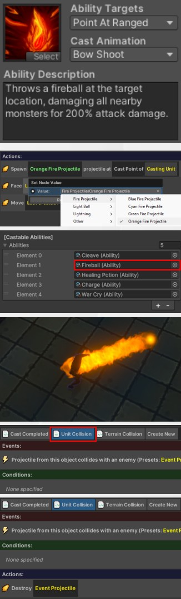

2. Right-click on the ‘Shoot’ ability and select `Copy`. Name the new ability
**Fireball**.

3. Change the ability description to “**Throws a fireball at the target location, damaging all nearby monsters for 200% attack damage.**”

4. Change the icon to something resembling a fireball by pressing the
‘Select’ button in the bottom-right of the icon.

5. This ability is quite strong (if you balance around a standard attack doing
100% of attack damage), so it should be given a resource cost or
cooldown. Update the Resource Cost to 15.

6. Next, we need to change the visuals of the ability. In the ability logic, the first line chooses which projectile to spawn. Click on the `Arrow` projectile, and change it to `Fire Projectile > Orange Fire Projectile`.

7. Finally, try adding the ability to a player and test it. You should now be
able to use the ability in-game and have it fire the updated projectile.

8. While this ability is functional, it currently only hits one specific target. While we updated the tooltip that the player reads, this currently doesn't reflect the projectile *behaviour*. 

8. Go to the Fireball ability in the Ability Editor and select the Unit Collision script. This script controls what will happen when the projectile collides with an enemy of the caster. Currently, it just does 100% of the caster’s attack damage to the unit and destroys the projectile This needs to be updated to deal damage in an area instead.

9. Select the damage action and press the `Delete` key (or right-click and
select Delete).

10. Now press the blue ‘`+`’ button in the `Actions` header. Select the `Unit >
Deal Damage to Unit Group` action.

11. Click on the ‘100%’ box and update the damage to be ‘200%’ (to match the ability tooltip you wrote earlier).

12. Click on the `Unit Group` box. This lets you specify which units should be in the damaged. Select the `All Enemies Near Point` function. In the first box, you can now specify how far away the enemies can be. Enter `2` (which will find all enemies within 2m). For the
“Location”, select `Projectile > Position of Projectile`. Click on the `Projectile` box and specify the `Event Projectile` preset as the projectile to use in the check.

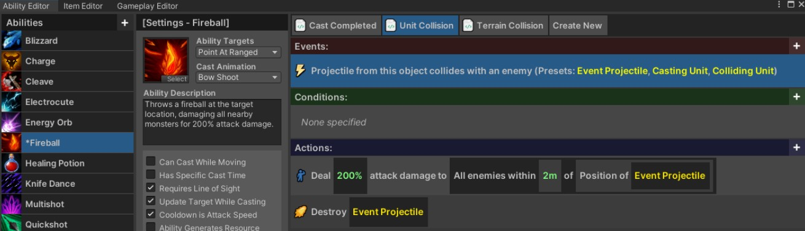

The logic for this ability should now be complete, and look like the image shown above. Try the ability now! When the fireball collides with a monster, it should damage all monsters within two meters.

---

## Example Custom Ability #2: Toxic Rage Potion
Another action which you may commonly want to do when creating abilities is to buff the player (e.g., increasing their damage, movement speed, attack speed, etc), or debuffing the monsters. For this ability, you will create a Toxic Rage Potion which will increase the damage done by the player for the next 10 seconds, but also increase the damage they take.

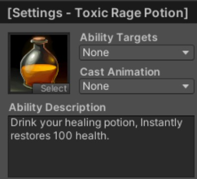

1. Right click on the `Healing Potion` ability, and select `Copy` to make a copy of it. Name it **Toxic Rage Potion**.
    
1. Change the tooltip to “**Increases your damage done and damage taken by
100% for 10 seconds.**”

1. Choose an appropriate icon for the ability.

1. In the ability logic, change the `Green Swirls` effect to `Swirls > Red Swirls` instead. This will ensure that it has a different visual to the regular health potion.

1. Delete the first action which adds health to the unit. Your logic should now look like the following:

    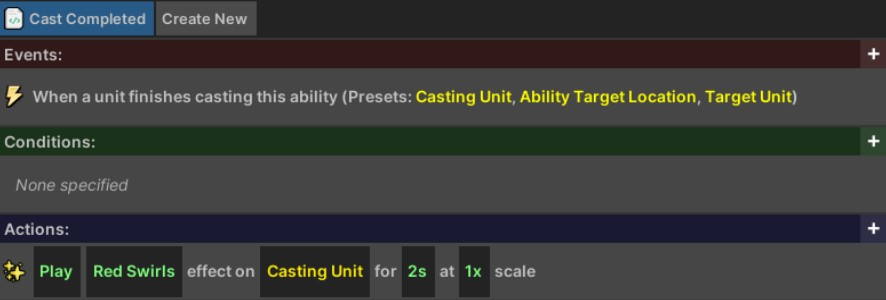

1. Add a new action by pressing the ‘`+`’ button in the `Actions` header. Select `Unit > Increase Stat > Increase Stat on Unit by Percent`. Select the `Unit` box, and choose the `Casting Unit` preset. Select the `Percent` box, and enter `100`. Select the `5s` duration and change it to `10` instead.

    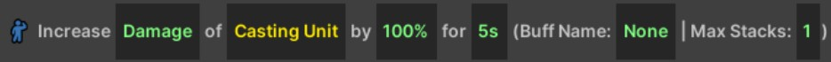

1. Select this buff action and Press `Ctrl+C` to copy it, and then `Ctrl+V` to paste it. Select the `Damage` box and change it to `Damage Taken` instead.

    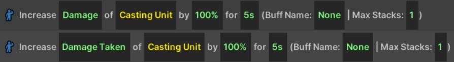

1. The potion should now have the correct effect. Add the ability to the player and try it out (the correct logic is shown below).

    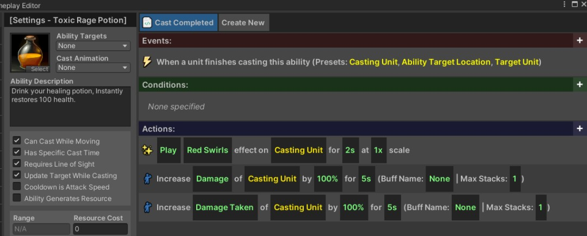

{: .important-title }
> Buff Names and Maximum Stacks
>
> You do not need to enter a Buff Name, but if you want to be able to remove the buff without waiting for it to timeout, you will need to give it a name you can refer to later. Additionally, if you want to limit the number of concurrent applications, you will need to give it a name and set the maximum number of stacks to your desired value.
>
> For example, you may have an ability that increases the movement speed of the caster by 25% for 3s, but it can stack up to three times (for a total of 75% movement speed).

---

## Example Custom Ability #3: Knife Barrage
This ability will showcase how you can use loops and waits to create some interesting effects. We are once again going to use the “Shoot” base ability, but we will update it so that it will periodically fire arrows towards the target location.

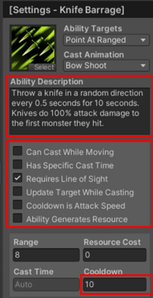

1. Right click on the `Shoot` ability, and select `Copy` to make a copy of it. Name it **Knife Barrage**.

1. Update the icon to something appropriate for the ability.

1. Change the tooltip to “**Throw a knife towards the target location every 0.5
seconds for 10 seconds. Knives do 100% attack damage to the first
monster they hit.**”

1. We don’t want this ability to be spammable, so uncheck the `Cooldown is
Attack Speed` option. This lets you set a custom cooldown. Change the
`Cooldown` to `10` seconds.

1. Disable `Update Target While Casting`. This option allows the ability to choose its final destination location at the end of the cast, rather than at the start. This can help make melee abilities feel responsive, but isn’t ideal for ranged abilities where the player may start the cast and then want to prepare to run away after it finishes.

1.  Next, in the ability logic, change the projectile being spawned from `Arrow` to `Other > Knife`.

1. Click on the ‘`+`’ button in the Actions header to add a new action. Select `Flow > For Loop`. In the “`Number`” slot, enter “`20`” (there will be two arrows every second for 10 seconds).

1. Drag the three above actions so that they are under/inside the loop. When you are done, it should look like below.

    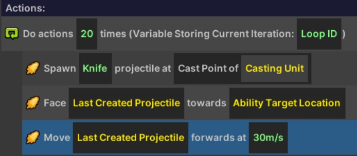

1. Finally, click on the `+` button on the loop action. Select `Flow > Wait`. In the `Number` slot, enter `0.5`. This will cause the logic to wait for 0.5 seconds before continuing. The final logic should look like the following:

    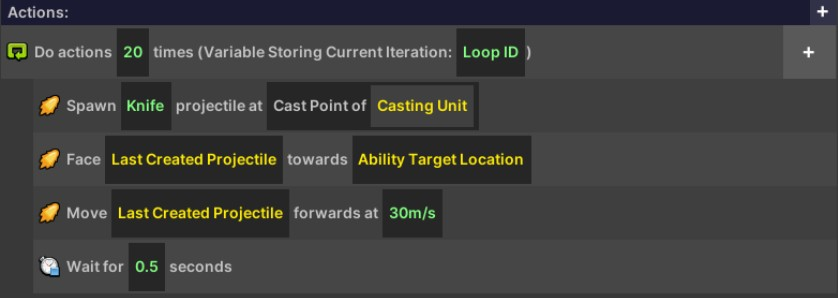

1. Add this ability to the player, and then try it out. The character should now throw 20 arrows towards the cast location, with a half-second delay between each.

---

## Example Custom Ability #4: Preparation
This ability will show you how you can create complementary logic to support an ability. Specifically, this ability will restore all resources to the caster and increase their attack speed by 100% until the caster next moves.

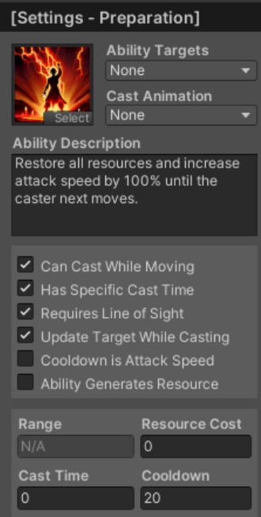

1. Right click on the `Healing Potion` ability and select `Copy`. Name the new ability **Preparation**. 

1. Update the tooltip to read “**Restore all resources and increase attack speed by 100% until the caster next moves.**”

1. Delete the add health action in the ability logic.

1. Change the `Green Swirls` effect to `Swirls > Yellow Swirls`.

1. Press the ‘`+`’ button in the `Actions` header to add a new action. Select `Unit > Add Resource`. Change the `100` to `9999` to have it (usually) restore the caster to maximum resource.

1. Press the `+` button in the `Actions` header to add a new action. Select `Unit > Increase Stat > Increase Stat on Unit by Percent`. Change the increased stat from `Damage` to `Attack Speed`. Change the `Unit` to the `Casting Unit` preset. Change the `Percent` to `100`. Change the `5s` to `0` (zero means lasts forever). Change the buff name from `None` to `Preparation`. It should now look as follows:

    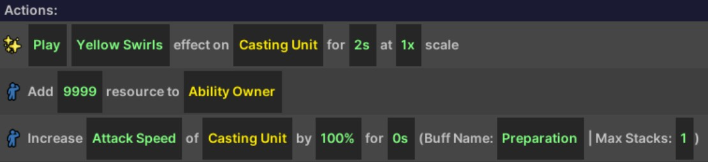

1. At the top of the window, press the `Create New` button to create a new script. Name the new script “**Remove Preparation on Move**”.

    

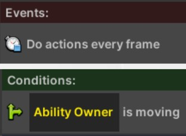

1. Click on the `+` in the events header to add a new event. Select `Time > Do every frame`.

1. Click on the `+` in the conditions header to add a new condition. Select `Unit > Unit is Moving` condition. Change the `Unit` slot to the `Ability Owner` preset.

1. Click on the `+` in the actions header to add a new action. Select `Unit > Remove Buff`. Change the buff name to `Preparation` and change the `Unit` slot to the `Ability Owner` preset again. The complete script should now look as follows:

    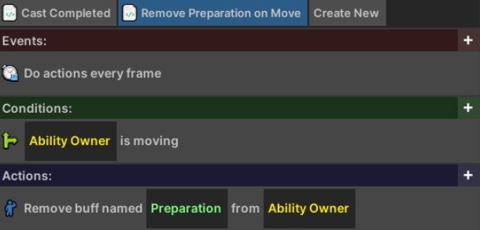

1. Save the ability by pressing `Ctrl+S`, then add the ability to a player and test it. After casting it, the player should now have 100% increased attack speed, but lose it when they next move.

{: .important-title }
> Using Additional Scripts in Ability Logic
>
> You may want to consider using additional scripts if your abilities have more complex logic. For example, you could have an extra script which reduces the cooldown of the ability whenever the player gets a critical hit, or does something else when the player kills a unit or takes damage.
>
> **Giving the player a timed effect**: If you want to have an ability with a prolonged custom effect (e.g., having the player restore health while moving, or generating resources when they’re attacked), you can achieve this by give them a buff using the `Unit > Increase Stat > Increase Stat on Unit by Percent` action, and leaving the modifier at 0% (you are just using it to specify a named buff). Then, in a separate script, you can check to see if the ability owner has that buff using the `Unit > Unit Has Buff` condition, and only do your custom logic if they do.
