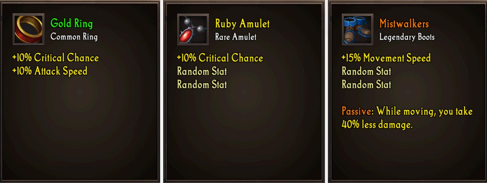
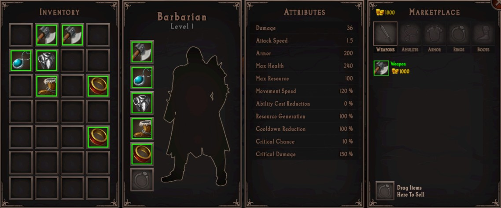
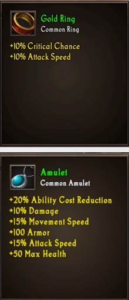
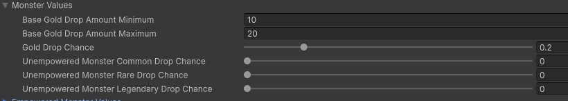
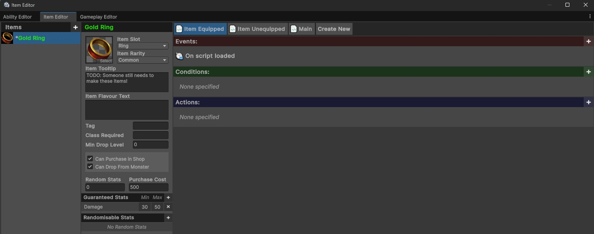
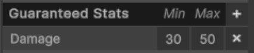
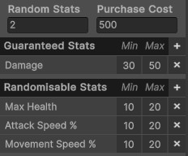

# Creating an Item
{: .no_toc }
In this guide, you will learn how to create and implement items into your experience.

---
<h2 class="text-delta">Contents</h2>
1. TOC
{:toc}
---

## Item Overview
Items come in one of three rarities: **Common**, **Rare**, and **Legendary**. The rarity of an item determines its drop chance and provides a rough indicator of how “good” an item is. Drop rates can be modified by adjusting the monster properties in the GameManager object within the Main scene.

There are **five types** of items that can be equipped. These are **weapons**, **amulets**, **armor**, **boots**, and **rings**.

There is a sixth “**Other**” type which can be used to create non-equippable items. For example, the game may not allow a player to open a door until they have a key in their inventory. 

The player can equip one of each of the item types, except for rings which allow **two** to be equipped at once. Players equip items by dragging them from their inventory onto the appropriate slot on their character.

---

## Item Attributes

Items will modify the attributes/stats of the player. There are many different stats an item may modify, but not all stats should necessarily be available on all item types.

- Max Health (e.g., +50 Maximum Health)
- Max Health Percent (e.g., +20% Maximum Health)
- Resource (e.g., +50 Maximum Rage)
- Resource Percent (e.g., +20% Maximum Rage)
- Damage (e.g., +10 Damage)
- Damage Percent (e.g., +20% Damage)
- Movement Speed Percent (e.g., +20% Movement Speed)
- Attack Speed Percent (e.g., +20% Attack Speed)
- Critical Strike Chance (e.g., +10% Critical Strike Chance)
- Critical Strike Damage (e.g., +50% Critical Strike Damage)
- Armor (e.g., +50 Armor)
- Resource Cost Reduction (e.g., -20% Ability Resource Cost)
- Resource Regeneration (+20% Rage Generation)
- Damage Reduction Percent (e.g., -20% Damage Taken)

---

## Adjusting Monster Drop Rates
To adjust the drop rate of items from monsters, select the `Game Manager` in the scene heirarchy. Expand out the `Monster Values` foldout. This contains three sliders - each controlling the drop chance for each item rarity. 

Monsters will only ever drop a **maximum of one item**. If a monster has a 100% chance to drop a common item, and a 50% chance for a rare item, half the time the drop will be common item, and half the time it will be rare item.

Empowered monsters have a different item drop chance. Go to the `Empowered Monster Values` foldout. This contains another three sliders. 

This can be very useful for designing exactly how you intend for rewards to be given to the player. For example, if you have a very low item drop chance from regular enemies, but guaranteed item drops from empowered enemies, players are encouraged to "hunt" empowered monsters.

---

## Creating an Item
To create an item, open the item editor by selecting `IGB190 > Open Custom Windows` from the top Unity menu. Go to the `Item` tab. This is the visual editor for creating items.

To create a new item, press the `+` button just above the list of items on the left panel. Give the new item a name. You can then modify the properties on the item. Below is a summary of the main item properties.

- **Item Icon**: To change the item icon, press the `Select` button in the bottom-right corner, and choose the icon you want to use.

- **Item Tooltip**: Use the tooltip to describe any custom features for the item. Stats will be automatically populated when the items is "rolled". You can safely leave this blank.

- **Tag**: You can assign a tag to the item. For example, you could have a "Cursed" tag, and then a legendary item may check how many cursed items the player has equipped. **You can safely leave this blank**.

- **Class Required**: If you only want the item to drop for a specific class, enter the name of the class here (e.g., `Barbarian`).

- **Min Drop Level**: This determines when the item can drop. If the item has a mnimimum drop level of 5, but the player is only level 3, it is not possible for this item to drop.

- **Can Purchase in Shop**: If your game contains custom legendaries, you may not want the player to be able to directly buy these. In this case, you can set this property to False.

- **Can Drop from Monster**: If your game contains custom legendaries, you may not want those legendaries to drop randomly (because they should drop at specific points in the experience). In this case, you should set this to False.

- **Purchase Cost**: The cost to purchase this item from the shop.

Finally, you need to specify the items can have. The game uses a "roll" system, where items can randomly roll various stats, and those stats have specific state ranges. For example, one copy of an item could come with `+10 damage` while another comes with `+50 Armor`. Items can have two types of stats: `guaranteed`, and `randomisable`.

- **Guaranteed Stats**: These are stats which the item will always have. For example, you may want a pair of boots to always come with increased movement speed. To add a guaranteed stat to an item, press the '+' button and choose the stat that it should have. You then need to specify the range for that stat.

    

- **Randomisable Stats**: These are the stats which the item **could have**. When an item is rolled, it chooses an amount of stats from this list equal to the value you have listed in the `Random Stats` input box above.

    

In the above example, the item will always have **Damage**, and will come with two of the following: **Max Health**, **Attack Speed %**, and **Movement Speed %**.

After you have chosen appropriate stats for the item, the item should now be completely set up and integrated into your experience.