# Creating a Legendary Item
{: .no_toc }
In this guide, you will learn how to create and implement custom legendary items into your experience.

---
<h2 class="text-delta">Contents</h2>
1. TOC
{:toc}
---

## Designing Legendary Items
Legendary items are powerful items which change the way the character "feels" to play. They should encourage the player to consider different moment-to-moment gameplay loops and add variety to the experience. The combination of character abilities and a collection of unique legendary items should form a **synergistic build**. For example, they may encourage the player to:

1. Take damage or stay on low health.
1. Fight lots of enemies at once.
1. Avoid taking damage.
1. Focus on a particular build, like critical strikes.
1. Have a drawback which must be managed (e.g., higher resource costs).

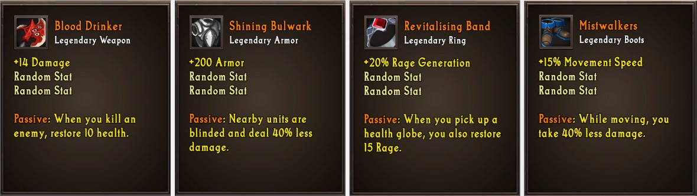

Creating these effects will often require you to code additional custom logic, beyond the standard stats that items typically have.

---

## Planning Legendary Drops
Legendary items should be powerful, build-defining, items. Given this, you should carefully control when the player can acquire these items.

- If you plan on having them be random drops, you should limit when they can drop. You can do this by specifying the `Min Drop Level` on the item.

- If you plan to have them drop from quests or off specific monsters, you should carefully plan when the player will acquire these items.

- If you plan to have these items be purchased from the shop, you should carefully consider how much the player will need to pay to acquire them.

It is important that the items aren't *too* rare either though. If the player is unable to finish their build and play with it before the end of the game, they will likely leave your experience unsatisfied.

---

## Example Legendary: Blood Drinker
The first example of a legendary item is **Blood Drinker**, a legendary weapon. It will have a custom effect which will heal you whenever you kill a monster. Here is the logic required to set it up:

1. Add a new `Event` by pressing the `+` in the events header. Select the `Unit > Unit is killed event`.

    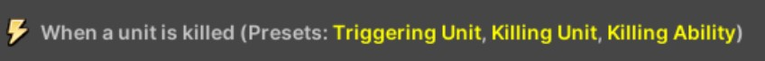

1. Add a new `Condition` by pressing the `+` in the events header. Select the `Comparisons > Unit Comparison` condition. In the first unit block, select the `Killing Unit` preset. In the second unit block, select the `Item Owner` preset.

    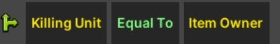

1. Add a new `Action` by pressing the blue `+` in the actions header. Select the `Unit > Add Health` action. In the number block, enter `10`. 

When you are done, the final logic should look like the following:

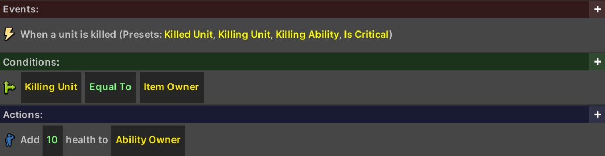

---

## Example Legendary: Mistwalkers
The next example of a legendary item is **Mistwalkers**, a pair of legendary boots. It will have a custom effect which will reduce the damage you take, but *only while moving*. Here is the logic required to set it up:

1. Add a new `Event` by pressing the `+` in the events header. Select the `Time > Do every X seconds` event, and then enter `0.5` seconds as the duration.

    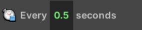

1. Add a new `Condition` by pressing the green `+` in the conditions header. Select the `Unit > Unit is moving` condition.

    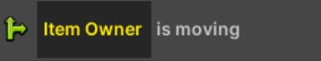

1. Add a new `Action` by pressing the `+` in the actions header. Select the `Unit > Decrease Stat > Decrease Stat on Unit by Percentage`.

    1. In the first block, choose `Damage Taken` as the stat to change.
    1. In the second block, choose the `Item Owner` preset for the unit.
    1. In the third block, enter `40` for the percentage.
    1. In the fourth block, enter `1` as the duration.
    1. In the fifth block, enter `Mistwalkers` as the buff name.

    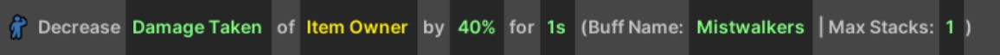

When you are done, the final logic should look like the following:

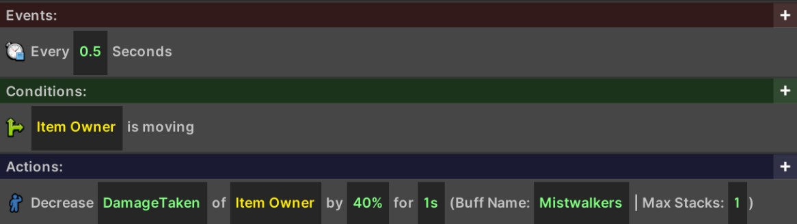

{: .important-title }
> Implementation Logic
>
> You may find that sometimes logic may seem complex, but a "close" version can be implemented much more easily. In this case, the logic periodically gives the player the buff, and then removes it if they ever move.

---

## Example Legendary: Revitalising Band
This example will guide you to implementing the **Revitalising Band** legenadary. It will have a custom effect which will restore source to the player whenever they pick up a health globe. While this is a straightforward effect, it can enable high-resource builds as long as the player is constantly picking up health globes.

1. Add a new `Event` by pressing the `+` in the events header. Select the Player > Player picks up a health globe.

    

1. Add a new `Action` by pressing the `+` in the actions header. Select the Unit > Add Resource. In the number block, enter 15.

    

When you are done, the final logic should look like the following:

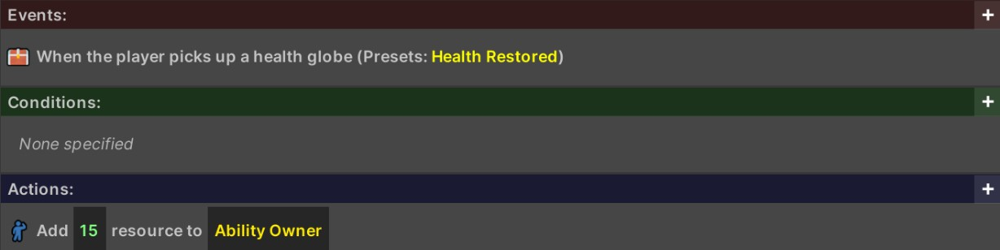

---

## Example Legendary: Shining Bulwark
The next example of a legendary item is **Shining Bulwark**, a legendary armor piece. It will have a custom effect which will reduce the damage done by nearby monsters. Here is the logic required to set it up:

1. Add a new `Event` by pressing the `+` in the events header. Select the `Time > Do every X seconds` event, and then enter `0.5` seconds as the duration. 

    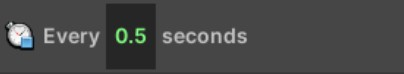

1. Add a new `Action` by pressing the `+` in the actions header. Select the `Variables > Set Unit Group` action. 
    1. Set the `Variable Name` to `Targets`.
    1. Change the `Unit Group` to `All Enemies Near Unit`. Change the `Number` to `3` and the `Unit` to the `Item Owner` preset. We can now refer to this variable in future calculations.

    

1. Add a new `Action` by pressing the `+` in the actions header. Select the `Unit > Decrease Stat > Decrease Stat of Unit Group by Percent` action.

    1. Change the `Stat` in the first block to `Damage`.
    1. Change the `Unit Group` block to `Unit Group Variable`, and the variable name to `Targets`.
    1. Change the `Percent` block to `40`.
    1. Change the `Duration` to `1` second.
    1. Change the `Buff Name` to `SB` (any name will do here).

    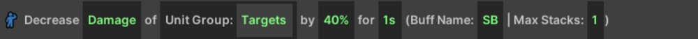

1. Add a new `Action` by pressing the `+` in the actions header. Select the `Feedback > Play Feedback on Unit Group` action.

    1. Change the first block to `Play or Refresh`.
    1. Change the effect block to `Floor Glow > Yellow Glow`.
    1. Change the `Unit Group` block to `Unit Group Variable`, and the variable name to `Targets`.
    1. Change the `duration` to `1` second.

    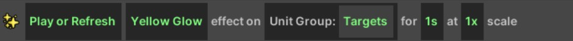

When you are done, the final logic should look like the following:

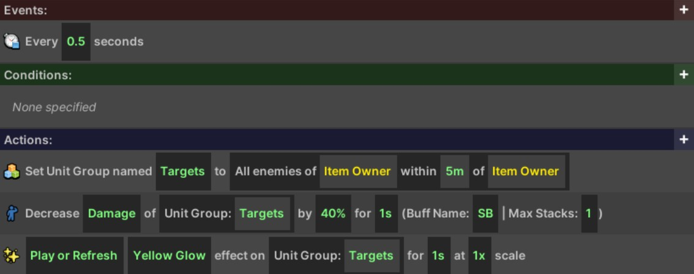
