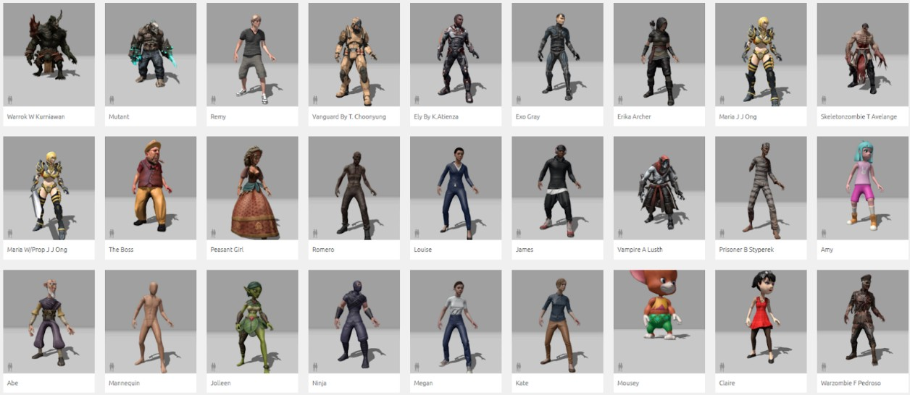
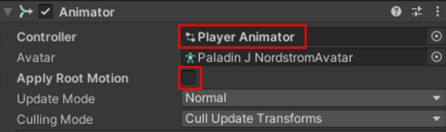
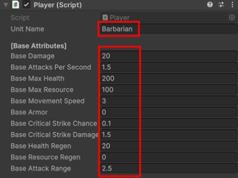
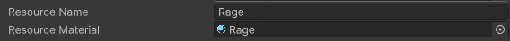
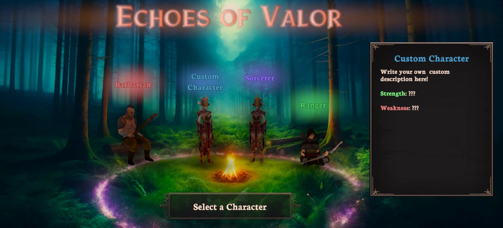

# Creating a Custom Character
{: .no_toc }
This page details how to create a custom character in the experience. This includes downloading and importing a character character model, attaching it to the player, and giving the player new custom abilities.

---
<h2 class="text-delta">Contents</h2>
1. TOC
{:toc}
---

## Designing a Custom Character
When designing your custom character, you should first consider the general archetype, theme, and playstyle it will have. This will help you identify a model and/or animations which would be suitable for your needs.

{: .highlight }
> 

> 
Character Archetypes

> 
> There are a lot of common character archetypes which you may want to consider using as a base for your character. These include:
>
> - **Warriors/Barbarians**: Melee combat. Physical damage. High defense.
>
> - **Mage/Sorcerer**: Ranged magic combat. Elemental damage. Crowd control. Low health.
>
> - **Rogue/Assassin**: Fast Attacks. High movement. Burst damage. Critical strikes.
> 
> - **Ranger/Archer**: High range. Multi-target attacks. Precise positioning and movement.
>
> - **Paladin/Crusader**: Balanced offense, defense, and healing. Focus on buffs and debuffs.
>
> - **Necromancer**: Death magic. Summoned minions. Resource sacrifice. Life drains.
>
> - **Druid/Shapeshifters**: Versatile. Transformations. Varied ability sets.
>
> - **Monks/Martial Artists**: Fists instead of weapons. Fast melee attacks. Energy manipulation.
>
> - **Engineer/Tinkerer**: Gadgets. Traps. Explosives.
>
> - **Berserker**: Massive melee damage, at the cost of health and/or defense. Encouraged to take damage.
> 
> - **Elementalist**: Ranged elemental magic with combos.
>
> There is also currently a shift away from the traditional generic archetypes to make characters feel more distinct and memorable (e.g., people may be more likely to remember your class if you name it a Sound Weaver instead of a Wizard, and then make the abilities all related to sound magic). Darkest Dungeon is a good example of this, using heroes like the Hellion, Grave Robber, Runaway, Leper, and Bounty Hunter (see here for a full list of playable heroes).
> 

## Finding a Character Model
In this unit, you will not have the time to model and rig your own character. Instead, you should source a custom character from online. You should consider looking at sources such as the Unity Asset Store or Mixamo (which is where the three current characters were found).

Once you have found a character, you will need to then download it and import it into your Unity project.

## Creating a Custom Character
To create your custom character, copy and paste one of the existing characters that are currently in the game scene. You may want to choose the one that has attributes which most closely match the character you want to design.

## Applying a Custom Model to a Player Character
Expand out the custom character, and delete the existing model for the character. Then, drag in your new character model and ensure that its position and rotation are all set to zero.

Next, you need to ensure that the model is using the correct animator. Select the custom model and in the animator, drag in the Player Animator into the controller slot (it can be found under `Core > Animations > Animator Controllers`).

The character should now be animated using the animation logic for all of the existing players.

## Change Player Attributes
To change the player attributes, select your custom player (not the model) and go to the Player component. Give your character a unique `Unit Name`, and update the attributes to more closely resemble the character's intended playstyle.

## Change Player Resource
Each of the player characters currently use a different thematic resource - the Barbarian uses Range, the Sorcerer uses Mana, and the Ranger uses Energy.

Create a new resource for your custom character. In the Player component, scroll down to the 'Unit Visuals' section, and change the `Resource Name` to your desired resource name.

When the user is playing with this character, the game will now automatically update all labels to use this specific resource name.

You can also create a new custom resource globe for this character. Navigate to `Core > Textures > UI > Resource Globes` and select one of the existing options. Press `Control+D` to duplicate it, and give it a new name.

Play with the values in the material until you get something that looks nice!

Once you are done, go back to your Player, and in the `Resource` slot shown above, drag in the material you just made. Your custom character will now use this resource globe visual.

## Giving the Player Custom Abilities
To change the abilities on the player, select the player and go to the `Player` component. Scroll down to the `Abilities` array. This array controls which abilities the player will have.

You should update this array to use the correct abilities for your custom character.

{: .important-title }
> Creating Abilities
>
> If you are unsure how to create abilities, you should read through the Creating an Ability guide.

## Adding to the Character Select Screen
To add a custom character to the character select screen, open the `CharacterSelect` scene, found in the `Scenes` folder. This Character Select screen has already been set up to accomodate one custom character.

Expand the `Custom Character Model` which can be found in the `Characters` GameObject in the scene heirarchy. Place your custom character **model** inside this model, ensuring that it is at a similar position as the original character.

Next, select the 'Nightshade' GameObject here (which has the visuals for the current character), and disable the `Skinned Mesh Renderer` component in the inspector. This will hide the model for that character.

Your custom character should now be displayed in the correct location on the screen.

{: .important-title }
> Adding an Idle Animation Animator
>
> You may want to create a custom animator for your character model here which just plays an idle animation (or drag in the `CharacterSelectSorcerer` animator which plays a standing idle animation).

Next, select the `Custom Character Model` GameObject in the heirarchy. It will contain a `Character Select` component. Update the name of the character to match the name of your custom character **exactly**.

Finally, you will need to update the description for your character. In the scene, expand out the `CharacterSelectUI` GameObject. Go to `Custom Character Components > CustomCharacterInfo > Title` and enter the name of the character again. Then, go to `Custom Character Components > CustomCharacterInfo > BodyText` and write the description for your character.

Your custom character should now be set up and selectable from the character select screen!