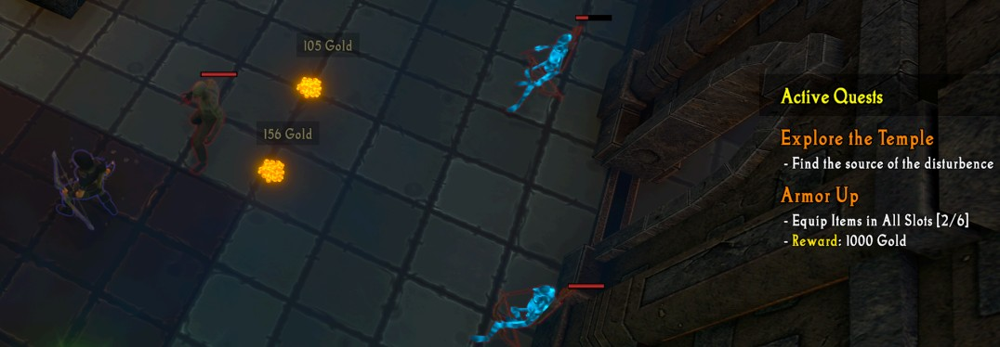
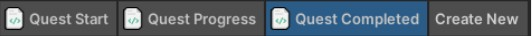

# Creating a Quest
{: .no_toc }
In this guide, you will learn how to create and implement custom quests into your experience.

---
<h2 class="text-delta">Contents</h2>
1. TOC
{:toc}
---

## Quest Overview
Creating a quest requires you to specify four pieces of information:

1. A quest **name**,
1. A quest **description**,
1. A list of quest **requirements**,
1. (optional) A quest reward.

This information will be shown to the player in the ‘Active Quests’ window shown on the right of the screen.

For each **quest requirement**, you must specify a **requirement name** and a number of **progress increments**. The progress increments keep track of quest progress. For example, if a quest requires you to kill 20 monsters, the requirement will have 20 progress increments, with the progress increments indicating how many monsters you have killed. Similarly, if a quest requires you to cast an ability 5 times, the increments would count how many times you have cast it. 

If a quest does not have incremental progress (e.g., killing a boss), it should have a single increment. This increment will not be shown to the player.

---

### Quest Logic
When the progress increment count matches the requirement (e.g., the quest has 5 progress increments and the player is at the fifth increment), that requirement is now complete. If all quest requirements on a quest are complete, the quest automatically completes.

### Defining the Quest Logic
A quest is usually defined in three visual scripts: 

1. **Quest Received**: Handles the creation of the quest when the necessary events occur.
1. **Quest Updated**: Handles updates to quest progress when the necessary events occur.
1. **Quest Completed**: Handles any quest reward actions when the quest is completed.

## Quest Examples
To help you better understand how to implement quests, the logic for three quests is shown below. Each of these demonstrate different quest features.

---

### Example Quest #1: Slay the Undead
The first example quest aims to show you how to handle basic quest setup and progress tracking. When the player first kills a monster, they will be given a quest asking them to kill 15 more monsters. As they kill monsters, quest progress will increment until they have killed all 15, at which point the quest will automatically be completed.

To create this quest, follow all of the steps below:
1. Open the Visual Scripting Windows (`IGB190 > Open Custom Windows`). Go to the `Gameplay Editor` tab.

1. In the `Game Logic` header in the top-left corner, create a new script group. Name it 'Quest - Slay the Undead'.

1. Rename the ‘Main’ script to ‘Quest Start’ (`Right Click > Rename`). 

    

1. Add a new Event (press the red `+` in the `Events` header). Select the `Unit > Unit is killed` event.

    

1. Add another new Action to this script, selecting the `Quests > Create Quest` action. Set the Quest Name to ‘Slay the Undead’.

    

1. Add another new Action to this script, selecting the `Quests > Add Quest Requirement` action. Set the **Requirement** to ‘Put the Dead to Rest’, the **Quest Name** to ‘Slay the Undead’, and the **Increments** to **15**.

    

1. Add a final Action to this script, selecting the `Flow > Disable This Script` action. This will ensure that the quest is only ever given to the player once.

    

1. Create a new script by pressing the `Create New`’` button at the top of the window. Name the new script 'Quest Progress'.

1. Add a new Event to this script (press the red ‘+’ in the ‘Events’ header). Select the `Unit > Unit is killed` event.

    

1. Add a new Condition (press the green ‘+’ in the ‘Events’ header). Select the `Quest > Quest Is Active` condition. Set the **Quest Name** block to 'Slay the Undead' (this must match the name you used earlier).

    

1. Add an Action to this script, selecting the `Quests > Modify Quest Progress` action. Set the **Quest Name** to 'Slay the Undead'. This will increment the current progress for the quest (in this case, this represents the number of monsters killed). When the current quest progress matches the required quest increments, the quest automatically completes.

    

The quest logic should now be fully implemented. The player will be given a quest to kill 15 monsters, and the progress should be automatically tracked as the player kills them.

{: .important-title }
> Quest Rewards
>
> As this is a very basic quest, it doesn’t currently have a reward. The remaining two example quests show how this can be done.

---

### Example Quest #2: Purchase an Item
The second example quest will prompt the player to purchase an item, and will hopefully encourage them to interact with the shop more throughout the experience. The quest will be given to the player if they pick up gold and have enough to make a purchase (in this case, 2500 gold). Then, the quest will be completed when they next purchase an item. Completing the quest will reward 500 gold.

The steps to implement this example quest are as follows:

1. Open the Visual Scripting Windows (`IGB190 > Open Custom Windows`). Go to the `Gameplay Editor` tab.

1. In the `Game Logic` header in the top-left corner, create a new script group. Name it `Quest - Purchase Item`.

1. Rename the `Main` script to `Quest Start` (`Right Click > Rename`). 

    

1. Add a new `Event` (press the red ‘+’ in the ‘Events’ header). Select the `Player > Player picks up gold` event.

    

1. Add a new `Condition` (press the green ‘+’ in the `Events` header). Select the `Comparisons > Number Comparison` condition. In the first `Number` slot, select `Player > Player Gold`. For the comparison, choose `Greater Than or Equal To`. In the second `Number` slot, enter `2500`.

     

1. Add another new `Action` to this script, selecting the `Quests > Create Quest` action. Set the `Quest Name` to **Spend Your Riches**.

    

1. Add another new `Action` to this script, selecting the `Quests > Add Quest Requirement` action. Set the `Requirement` to ‘**Purchase an Item**’ and the `Quest Name` to ‘**Spend Your Riches**’.

    

1. Add another new `Action` to this script, selecting the `Quests > Add Quest Reward` action. Set the `Reward` to ‘**500 Gold**’ and the `Quest Name` to ‘**Spend Your Riches**’. (Note: This only adds the reward to the quest label visible to the player, you need to manually provide the rewards yourself).

    

1. Finally, add a final `Action` to this script, selecting the `Flow > Disable This Script` action. This will ensure that the quest is only ever given to the player once.

    

1. Create a new script by pressing the `Create New` button at the top of the window. Name the new script “**Quest Completed**”.

    

1. Add a new `Event` to this script (press the red ‘+’ in the ‘Events’ header). Select the `Player > Player buys an item` event.

    

1. Add a new `Condition` (press the green ‘+’ in the ‘Events’ header). Select the `Quest > Quest Is Active` condition. Set the `Quest Name` block to “**Spend Your Riches**”.

    

1. Add an `Action` to this script, selecting the `Quests > Modify Quest Progress` action. Set the `Quest Name` block to “**Spend Your Riches**”.

    

1. Add an `Action` to this script, selecting the `Player > Add Gold` action. Set the `Number` to `500`.

    

1. Add an `Action` to this script, selecting the `Flow > Disable This Script` action.

    

{: .important-title }
> Quest Rewards
>
> When you are adding a quest reward to your quest, remember that the 'Add Quest Reward' action doesn't implement any logic. This is just a label that is shown to the player (e.g., it could say something like 'Unlock Hidden Power'). You need to manually add the completion rewards yourself (in this case, 500 gold is added to the player when the quest completes).

{: .important-title }
> Starting Quests on Specific Conditions
>
> This quest shows how you can give the player a quest only after a specific condition is met. In this example, the player isn't given the quest until they collect gold, and they have at least 2500 gold to spend. This ensures that the player has enough gold to spend at the shop and they aren't trying to buy an item when they don't have enough gold.

---

### Example Quest #3: Armor Up
The third example quest will prompt the player to equip an item in every slot. This aims to remind players that they need to equip items. This quest has six ‘progress increments’ as the player can equip six items at a time. Whenever the player equips or unequips an item, the quest progress will update to match the current number of items the player has equipped. If the player has items equipped in all six slots, the quest will complete and the player will be given the gold reward.

The steps to implement this example quest are as follows:

1. Open the Visual Scripting Windows (`IGB190 > Open Custom Windows`). Go to the `Gameplay Editor` tab.

1. In the `Game Logic` header in the top-left corner, create a new script group. Name it '**Quest - Armor Up**'

1. Rename the `Main` script to ‘**Quest Start**’ (`Right Click > Rename`). 

    

1. Add a new `Event` (press the red ‘+’ in the `Events` header). Select the `Player > Player equips an item` event.

    

1. Add another new `Action` to this script, selecting the `Quests > Create Quest` action. Set the `Quest Name` to ‘**Armor Up**’.

    

1. Add another new `Action` to this script, selecting the `Quests > Add Quest Requirement` action. Set the `Requirement` to ‘**Equip Items in All Slots**’, the `Quest Name` to ‘**Armor Up**’, and the `Increments` to `6`.

    

1. Add another new `Action` to this script, selecting the `Quests > Add Quest Reward` action. Set the `Reward` to `1000 Gold` and the `Quest Name` to ‘**Armor Up**’.

    

1. Finally, add a final `Action` to this script, selecting the `Flow > Disable This Script` action. This will ensure that the quest is only ever given to the player once.

    

1. Create a new script by pressing the `Create New` button at the top of the window. Name the new script “**Quest Progress**”.

1. Add a new `Event` to this script (press the red ‘+’ in the `Events` header). Select the Player > Player equips an item event.

1. Add a new `Event` to this script (press the red ‘+’ in the `Events` header). Select the `Player > Player unequips an item` event. This will ensure the script runs whenever an item is equipped or unequipped (i.e., the player equipment changes in any way).

    

1. Add a new `Condition` (press the green ‘+’ in the `Events` header). Select the `Quest > Quest Is Active` condition. Set the `Quest Name` block to “**Armor Up**”.

    

1. Add an Action to this script, selecting the `Quests > Set Quest Progress` action. Set the `Quest Name` to “**Armor Up**”. Set the `Number` to `Players > Items Equipped`. This will update the quest progress to match the number of items equipped (e.g., if the player has three items equipped it will show as 3/6 items equipped).

    

1. Create a new script by pressing the ‘**Create New**’ button at the top of the window. Name the new script “**Quest Completed**”.

1. Add a new `Event` to this script (press the red ‘+’ in the `Events` header). Select the `Quests > On quest completed` event. Set the `Quest Name` to ‘**Armor Up**’.

    

1. Add an `Action` to this script, selecting the `Player > Add Gold` action. Set the `Number` to `1000`.

    

{: .important-title }
> Quest Increments
>
> This quest shows an example of a quest with a set number of increments (in this case, 6 increments) that don't just count up one at a time. Instead, the current number of progress increments is driven by some game data - specifically the number of items the player currently has equipped.