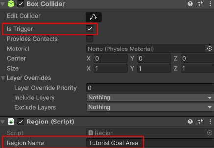

# Regions
{: .no_toc }
Regions are used as a simple way of handling logic in which things happen when the player enters, leaves, or stays in an area.

---
<h2 class="text-delta">Contents</h2>
1. TOC
{:toc}
---

## Creating a Region
To create a region, create a GameObject, such as a cube, and give it a collider. Ensure that the `Is Trigger` property is set to `True`. Then, add a `Region` component. Enter an appropriate name for the `Region Name` property, so that you can refer to it later.

## Purpose of Regions
The application also provides simple functionality for removing regions, allowing you to designate areas of the game which can be removed when needed. Some common example use-cases for regions include:

1. **Checking when the player enters an area**. For example, you may want to only trigger some actions (such as dialogue) when a player enters a room.
1. **Checking when the player is in an area**. For example, you may want to constantly damage the player while they are standing in fire.
1. **Creating blockers**. For example, you may have an invisible blocker region that prevents the player from going through a door until after the player collects a key.

{: .important-title }
> Do I need to use regions?
>
> Regions are not required. They provide some simple functionality which is useful when using the visual coding system. If you are writing your own code, you can use regular Unity methods, such as OnTriggerEnter and OnTriggerExit instead.