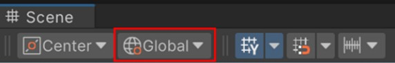
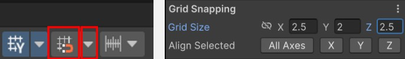

# Creating a Level
{: .no_toc }
In this guide, you will learn how to implement a custom level. Your level should be designed so that it has sufficient variety and length to show off the mechanics and overall design of your experience (particularly the abilities, items, and overall character synergies). It is important that your level isn't **too long**, as this may cause players to become disengaged.

Overall, you should be looking to build an experience that lasts ~10 minutes in length, and effectively meets the design pillars for the experience.

---
<h2 class="text-delta">Contents</h2>
1. TOC
{:toc}
---

## Using the Default Tiles
The project includes a variety of level tiles. These tiles can be snapped together to build an environment very quickly. This approach is broadly known as **Modular Level Design**. When done with larger areas, these are often referred to as **Tiles** and the collection of available tiles is known as the **Tileset**.

{: .important-title }
> Modular Level Design
>
> Modular design is the practice of building game environments from reusable pieces, like rooms, corridors, floors, and props, that fit together seamlessly. This approach saves time, keeps the visual style consistent, and allows designers to quickly create varied layouts by reusing the same parts. It also works well with procedural systems, making it possible to generate large or unpredictable levels without needing to handcraft every detail.

You can find the tiles in the project by going to `Assets to Use > Tilemap > Rooms`. Each room is built using a small collection of pieces:

1. **Floors**: Each floor tile is `5m x 5m`. To add some variety, the project has three possible floor tiles.
1. **Walls**: Each wall is `5m` wide and should align with the floor tiles perfectly.
1. **Pillars**: The pillars are used to hide visual issues when two walls connect, or provide some basic set dressing to larger spaces.
1. **Ramps**: Ramps are used to provide some verticality to the environment. Each ramp changes the elevation by `2m`.

## Setting up Snapping
As all of the environmental pieces have very specific sizes, Unity's snapping tool can be used to ensure that all environmental pieces align *exactly*.

At the top of the Scene window, there is a dropdown which controls the rotation mode. It can either be set to `Local` or `Global`. Ensure that this is set to `Global`. 

At the top of the scene view again, ensure that the magnet toggle is enabled. Then press the dropdown, and change the snapping size to `X=2.5, Y=2, Z=2.5`.

{: .important-title }
> Why these numbers?
>
> These numbers were chosen because they’re good values for this project. The ground tiles are all exactly 5x5m, so this means that you will always drag objects in increments of half a tile. Moving in half increments allows for finer control - such as if you want to place a pillar in the center of a tile. Moving in Y increments of 2 ensures that if you move a tile down, it will always be aligned perfectly with how much a ramp would lower the player.

## Placing Tiles
Once you have snapping set up, drag any of the default tiles into the scene. You should then be able to drag them around, and they should connect perfectly with the existing tiles. This allows you to quickly build distinct modular levels.

{: .important-title }
> Making Minor Adjustments to Specific Tiles
>
> After you place all of the tiles, you may need to make some small adjustments. For example, you may need to add or remove walls such that tiles connect 'nicely'. This is completely normal - making changes to specific tiles will not override the tiles.

## Rebuilding Navigation
After you have added new tiles, you will need to rebake your navigation. In the scene heirarchy, select the `Navigation` GameObject, go to the `NavMesh Surface` component and press the `Bake` button.

You should now have a working environment!