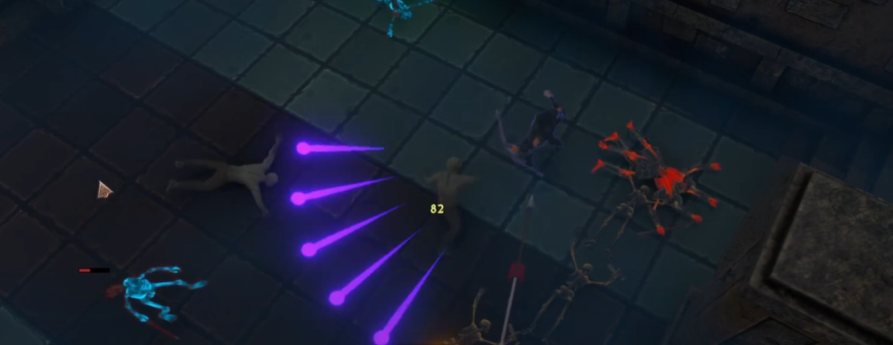
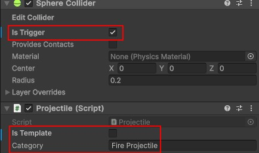
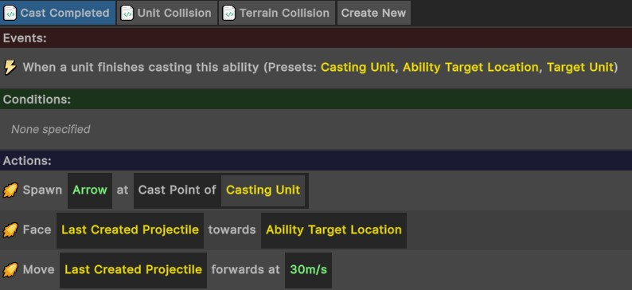
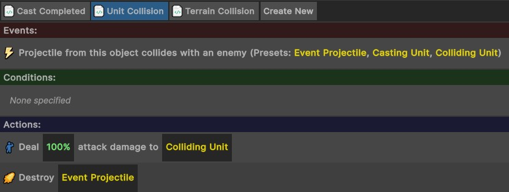

# Projectiles
{: .no_toc }
All ranged abilities which shoot a GameObject into the level are handled through the **Projectile** system. Only GameObjects that you have specifically set up in your project with a Projectile component will be available to spawn through the visual scripting system.

---
<h2 class="text-delta">Contents</h2>
1. TOC
{:toc}
---

## Creating a Projectile
To create a projectile, create a GameObject (or take an existing GameObject, such as a particle effect) and give it a collider. Ensure that the `Is Trigger` property is set to `True`. Then, add a `Projectile` component to it.

In the `Category` property, enter the category this projectile should have (e.g., "Fireball"). This will make it easier to find specific types of projectiles when selecting one in the visual editor.

If the projectile is actually just a template, and shouldn't appear as a spawnable projectile, set the `Is Template` property to `True`, otherwise leave this as `False`.

## Projectile Properties
You can define the exact properties of a projectile when it is spawned. To first spawn a projectile, use the *Spawn Projectile* action in the visual coding system:

- **Spawning the Projectile**: This spawns the specified projectile at the specified location in the environment.

Then, use any of the below actions to handle the behaviour of the projectile:

- **Move Projectile Forwards**: Use this to fire the projectile forwards at a given speed.
- **Set Lifetime**: Sets the time before the projectile destroys itself. Set this if you don't want the projectile to travel indefinitely (e.g,, if you don't want enemies far off-screen to be hit).
- **Rotate Projectile**: Use this to adjust the rotation of a spawned projectile. Do this after you spawn the projectile (e.g., if you want to have it face a random direction, or spawn multiple projectiles that all have slightly different rotations).
- **Face Projectile Towards Point**: Use this if you want to fire the projectile towards a specific point.

Finally, use the *Destroy Projectile* action to destroy the projectile.

- **Destroy Projectile**: Destroys the specified projectile. Use this if you want to destroy a projectile on a specific condition (e.g., after it hits a target).

## Visual Scripting Example
Implementing the logic for a projectile is usually done in two scripts. The first script handles the spawning and initial behaviour of the projectile, while the second script handles the collision logic. Below is the logic for the `Shoot` ability.

**Spawning the Projectile**: This script spawns the projectile when the ability is first cast, then faces it towards the target and moves it forward at 30 metres per second.

**Checking for Collisions**: This checks for collisions with the projectile, and if one is found, it deals damage to the target and destroys the projectile.

{: .important-title }
> Projectile Collisions
>
> It is not required that the projectile be destroyed when a collision occurs. If the projectile isn't destroyed, it would instead pierce through enemies. Projectiles can also do actions other then damage when a hit is made.