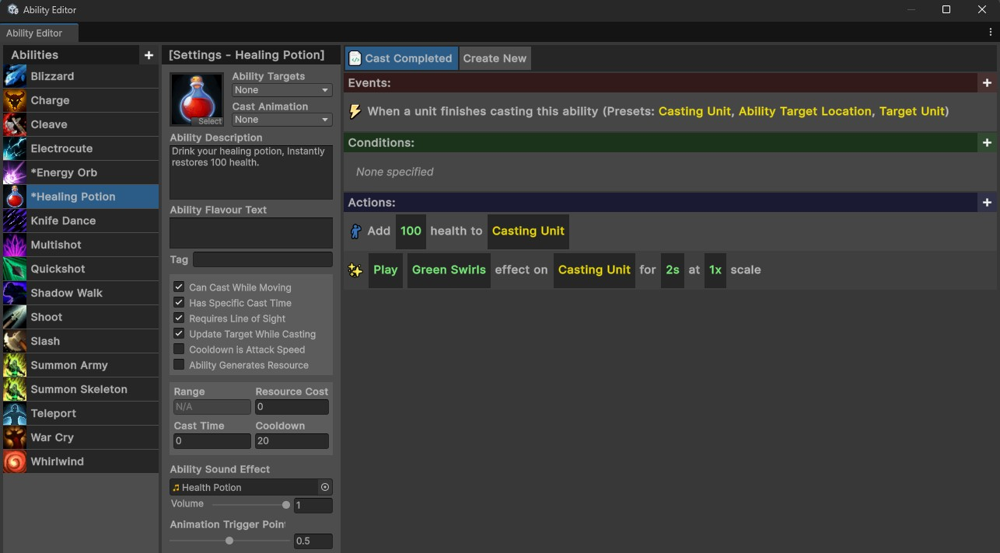
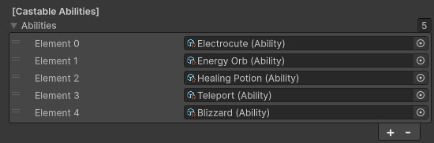

# Abilities
{: .no_toc }
Abilities are a key part of the overall experience. All non-walking actions done by both the player and the monsters are controlled through abilities. Even simple logic, such as spammable basic attacks are defined by abilities.

---
<h2 class="text-delta">Contents</h2>
1. TOC
{:toc}
---

## Creating Abilities
All abilities must be created through the **visual scripting system**. This system provides a visual way to create abilities and assign them basic information, such as a description, cost, cast time, range, sound effect, animation, and other related information.

This system also provides an easy way to visually browse all abilities in the application and make modifications quickly to foster rapid testing and refinement.

In addition to specifying all the casting information, the visual scripting system can also handle all of the ability "logic" as well, though this isn't required. All of the abilities for the three existing characters were made entirely using this visual logic. For more information on how to implement custom abilities using this system, read the [**Creating an Ability**](../igb190-guides/guide-createability.html) guide.

## Assigning Abilities
You can quickly assign an ability to either a player character or a monster by selecting the GameObject and going to the abilities list (in either the `Player` or `Monster` component). This list can contain any number of abilities (though the Player UI will only show the first five).

{: .note }
One powerful benefit of this system is that it uses modular actions which aren't coded specifically for the player or the monsters. This means that the same ability can be used on both a player and a monster without any issues. For example, you could give a monster the **Charge** ability and the monster would correctly charge towards the player and deal damage to them. Similarly, you could give a monster the **War Cry** ability and it would buff all other nearby monsters.

## Ability Casting Logic - Player
The player will only try to cast abilities when a corresponding input is sent from the player. This means that only the first five abilities are correctly mapped to keyboard keys, and any further 'active' abilities beyond the fifth cannot be cast. If you did any any 'passive effect' abilities though, they would continue to operate corretly.

## Ability Casting Logic - Monsters
Monsters will **constantly** try to cast their abilities. If all requirements for an ability are met (such as range and resource cost), the monster will begin casting it.

Monsters will always move to position themselves such that all of their abilities are in range of the target. This means that if the unit only has a ranged attack, they will stay at a distance. If the unit has both a ranged and a melee attack, however, they will continue moving towards the player in-between casts of their ranged attack.

{: .note }
Monsters have the same resource restrictions that players do. This means that you can give a monster a powerful attack which requires a resource cost, and it will not cast until the unit has gathered enough resources. The current UI for the monsters does not display their resource, however, so this is not information that the player can see. In most situations, it is likely easier to instead use cooldowns to limit monster casting, but if you want to prevent the monster from casting an ability *immediately*, you can use a resource limitation instead.

## Locking and Unlocking Abilities
Giving all abilities to a Player at the start of the game can be very overwhelming. For this reason, the game allows you to lock and unlock abilities. This allows you to stagger unlocks so that they align with actions completed within the game, or the player leveling up. Locked abilities do not appear for the player in the UI, to avoid any confusion over whether or not they can be cast.

For example, your experience could lock three of the five abilities at the start of the game, then unlock one every time the player levels up.

## Replacing Abilities
The game also gives you the ability to **replace** abilities. This is very powerful if you want to make major adjustments to the functionality of an ability (e.g., when the player has a specific legendary item equipped). In this case, it may be easier to swap in a new ability when the item is equipped, and swap it back out if it is ever unequipped again.

{: .note }
Replacing abilities can also allow you to implement logic which seems very complex in a much simpler manner. For example, you may create a legendary effect which causes one of your abilities to become greatly empowered for a few seconds after you drink a health potion. In this case, it is likely simplest to just replace the ability and then revert it back after a few seconds (or when the ability is cast).

