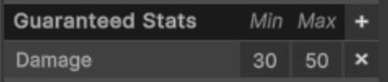

# Items
{: .no_toc }
Items are intended to be a core part of your overall experience. Items, especially legendary items, should form a large part of your final build and the intended playstyle for your custom character. This page provides a brief overview of items and their key features.

---
<h2 class="text-delta">Contents</h2>
1. TOC
{:toc}
---

## Item Overview
Items come in one of three rarities: **Common**, **Rare**, and **Legendary**. The rarity of an item determines its drop chance and provides a rough indicator of how “good” an item is. Drop rates can be modified by adjusting the monster properties in the `GameManager` object within the Main scene.

There are **five types** of items that can be equipped: **Weapons**, **Amulets**, **Armor**, **Boots**, and **Rings**. There is a sixth “**Other**” type which can be used to create non-equippable items. For example, the game may not allow a player to open a door until they have a key in their inventory. 

The player can equip **one** of each type of item, except for rings, which allow **two** to be equipped at once. Players equip items by dragging them from their inventory onto the appropriate slot on their character.

{: .warning }
It is strongly recommended that you do not change the item types or rarities in your experience. These changes are non-trivial to make, and may consume a large amount of time for very few marks. You should instead spend this time designing your item and ability synergies to demonstrate an interesting **character build**.

---

## Item Attributes

Items will modify the attributes/stats of the player. There are many different stats an item may modify, but not all stats should necessarily be available on all item types.

- Max Health (e.g., +50 Maximum Health)
- Max Health Percent (e.g., +20% Maximum Health)
- Resource (e.g., +50 Maximum Rage)
- Resource Percent (e.g., +20% Maximum Rage)
- Damage (e.g., +10 Damage)
- Damage Percent (e.g., +20% Damage)
- Movement Speed Percent (e.g., +20% Movement Speed)
- Attack Speed Percent (e.g., +20% Attack Speed)
- Critical Strike Chance (e.g., +10% Critical Strike Chance)
- Critical Strike Damage (e.g., +50% Critical Strike Damage)
- Armor (e.g., +50 Armor)
- Resource Cost Reduction (e.g., -20% Ability Resource Cost)
- Resource Regeneration (+20% Rage Generation)
- Damage Reduction Percent (e.g., -20% Damage Taken)

{: .note }
This is a very large set of possible item stats. You do not need to have your items use all of these stats. You may find that players find your experience more understandable with a smaller subset of these!

---

## Adjusting Monster Drop Rates
To adjust the drop rate of items from monsters, select the `Game Manager` in the scene heirarchy. Expand out the `Monster Values` foldout. This contains three sliders - each controlling the drop chance for each item rarity. 

Monsters will only ever drop a **maximum of one item**. If a monster has a 100% chance to drop a common item, and a 50% chance for a rare item, half the time the drop will be common item, and half the time it will be rare item.

Empowered monsters have a different item drop chance. Go to the `Empowered Monster Values` foldout. This contains another three sliders. 

This can be very useful for designing exactly how you intend for rewards to be given to the player. For example, if you have a very low item drop chance from regular enemies, but guaranteed item drops from empowered enemies, players are encouraged to "hunt" empowered monsters.

---

## Creating an Item
To create an item, open the item editor by selecting `IGB190 > Open Custom Windows` from the top Unity menu. Go to the `Item` tab. This is the visual editor for creating items.

### Item Properties 
The below table describes each of the properties an item can have which do not affect its overall stats or behaviour. These instead control the item's visuals, how it can drop, and other similar logic.

|**Property** | **Description** |
| Item Icon | Controls the visual for the icon. To change it, press the `Select` button in the bottom-right corner, and choose the icon you want to use |
| Item Tooltip | Use the tooltip to describe any custom features for the item. Stats will be automatically populated when the items is "rolled". You can safely leave this blank. |
| Tag | An **optional** tag for the item. For example, you could have a "Cursed" tag, and then a legendary item may check how many cursed items the player has equipped.
| Class Required | If you only want the item to drop for a specific class, enter the name of the class here (e.g., "Barbarian"), otherwise leave this blank. |
| Min Drop Level | Controls when the item can drop. If the item has a minimum drop level of 5, but the player is only level 3, it is not possible for this item to drop. |
| Can Purchase in Shop | Controls whether the item appears in the shop. If your game contains custom legendaries, you may not want the player to be able to directly buy these. |
| Can Drop from Monster | Controls whether the item can drop from monsters. If your game contains custom legendaries, you may not want these to drop off random enemies. |
| Purchase Cost | The cost to purchase this item from the shop. |

### Item Stats
In addition to the above properties, you also need to specify the stats that an item can have. The game uses a "random roll" system, such that the same item can "roll" with different stats and values every time it drops or is purchased by the player. For example, one copy of an item could come with `+10 damage` while another comes with `+50 Armor`.

Items can have two types of stats: **guaranteed** and **randomisable**.

Guaranteed stats are stats which the item **will always have**. Every time the item is rolled, every guaranteed stat will always appear on the item. For example, you may want a pair of boots to always come with increased movement speed. To add a guaranteed stat to an item, press the '+' button in the "Guaranteed Stats" block and choose the stat that it should have. You then need to specify the range for that stat.

Randomisable stats, on the other hand, are the stats which the item **could have**. When an item is rolled, it chooses an amount of stats from this list equal to the value you have listed in the `Random Stats` input box above.

In the above example, the item will always have **Damage**, and will come with two of the following: **Max Health**, **Attack Speed %**, and **Movement Speed %**.

When "rolling" an item, the item will randomly choose a value between the minimum and maximum amounts listed. This means that every time the above item drops, it will always have somwhere between 30 and 50 damage.

{: .note }
You may find that players are overwhelmed with large stat ranges. If so, you should consider lowering the range, or even removing them entirely for some (or all) of the stats. An item system is only interesting for the player if they can evaluate and effectively compare items, and having too much information on an item can make this difficult.

After you have chosen appropriate stats for the item, the item should now be completely set up and integrated into your experience.

## Creating Items with Custom Effects
You can use the visual scripting system (or standard Unity C# code) to add custom logic to each item. Custom logic can make items much more engaging beyond simple stat changes. To learn more about how to do this, read the [Creating Legendary Items](../igb190-guides/guide-createlegendaryitem.html) guide.

