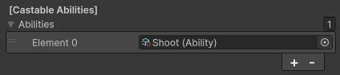

# Monsters
{: .no_toc }
Monsters are used to represent all characters in the game which are not the main player character. The way you design your monsters will have a large impact on the overall player experience and the way your combat system and final character build feel.

---
<h2 class="text-delta">Contents</h2>
1. TOC
{:toc}
---

## Monster Overview
The default monsters that come with the experience can be found in the project under `Assets to Use > Monsters`. These contain some very basic example monsters with some visual differences. Currently, however, there are very few mechanical differences between each of these though. You should update these monsters, or create your own set of monsters, which allow for a more interesting gameplay experience.

## Monster Stats
All of the main stats for a monster can be found on its `Monster` component. Note that all of these stats are described as a `Base Value` because items and other modifiers can further modify these values during gameplay.

| Base Damage | The default damage of the monster before any modifiers. This affects all damage the monster does through abilities. |
| Base Attacks Per Second | The attack speed of the monster. A higher value is better (i.e. 1 = 1 attack per second, 2 = 2 attacks per second). |
| Base Max Health | The base health of the unit. When the unit is spawned, it will be set to this amount of health. | 
| Base Max Resource | The base resource of the unit. By default, units spawn with zero resource. |
| Base Movement Speed | The movement speed of the unit (in units/second). This is the speed that will be fed into the nav mesh agent. |
| Base Armor | This is the base armor for the unit. The effect of this armor will be dependent on your exact armor implementation. |
| Base Critical Strike Chance | The critical strike chance of the unit before modifiers. The unit has this chance to deal additional damage (the additional damage is determined by the critical strike damage stat). |
| Base Critical Strike Damage | The critical strike damage of the unit. This determines the damage modifier which will affect all critical strikes (i.e., 2 = 200% of standard damage). |
| Base Health Regen | The health regeneration of the monster. The monster will regain this much health per second (i.e. 10 = 10 health restored per second). |
| Base Resource Regen | The resource regeneration of the monster. The monster will regain this much resource per second (i.e. 10 = 10 resource restored per second). |
| Base Range | Controls the swing distance for melee attacks on the monster. A higher value means that the monster can attack units from further away. |

## Monster Properties
Monster properties can also be found on the `Monster` component. These values control properties related to the monster which do not affect its combat or behaviour.

| Gold Modifier | This adjusts the amount of gold dropped by the monster. A gold modifier of 3 would cause the monster to drop three times as much gold as a monster with a modifier of 1. This ensures that you can make more powerful monsters reward more gold (or make some monsters reward less). |
| Experience Modifier | This adjusts the amount of experience awarded by the monster. An experience modifier of 4 would cause the monster to award four times as much experience as a monster with a modifier of 1. This ensures that you can make more powerful monsters award more experience (or make some monsters give less). |
| Corpse Duration | The corpse duration controls how long the monster corpses will linger before they are removed from the experience. This has no impact on gameplay, but will affect overall performance of the experience. |
| Monster Label | This is an optional parameter you can set if you want to be able to refer to a specific monster. For example, if you manually place some monsters in the environment and want to be able to check when they are killed, you could give them all their own label and check if the killed monster had that label. |

## Monster Spawn Data
Monster spawn data can be found at the bottom of the `Monster` component. There are two values here which control how the monsters are spawned in the experience.

| Spawn Level | This does not affect the power of the monster at all. Instead, the level of the monster is considered when deciding appropriate monsters to be spawned in each room. In each room you can set a maximum spawn level, which prevents high-powered monsters from spawning in rooms you have marked as having a low maximum level. |
| Spawn Liklihood | This value controls how likely the monster is to be spawned by the spwaning system. If one monster has a spawn likelihood of 2, and another has a spawn likelihood of 4, the second monster will spawn twice as often (because it's value is double the first monster). This provides some quick controls to ensure that powerful enemies spawn less often. |

{: .note }
By default, all monsters in the experience have a spawn likelihood of 10 and a spawn level of 1. This means that any spawner can spawn any monster, and all monsters are equally likely to spawn. After deciding on an appropriate set of monsters for your experience, you should consider whether these values need to be adjusted.

## Monster Abilities
The `Monster` component contains an array of abilities which represent the abilities the monster is able to cast. The monster will constantly try to cast each of their assigned abilities, but will only cast if the cast would be valid (e.g., there is a target in range, they have the required resources, etc).

Currently, the melee monsters are using the basic `Slash` ability which deals a small amount of damage to targets hit in melee, and the ranged monster uses the `Shoot` ability, which fires a basic arrow which damages a target when hit.

Functionally, these abilities serve as a good "base" for these monsters, as you likely *do* want the monsters to swing or shoot at the player. For more advanced abilities, however, you may want to also introduce some additional logic. For example, you may have a monster which randomly teleports, or a monster which causes its nearby allies to take less damage. In these situations, you can just add these custom abilities to the ability lists on the monsters.

{: .note }
While it can be interesting to give monsters some impactful additional abilities, you should do this sparingly. You don't necessarily want every monster to have bespoke custom effects which the player must learn to counter, as the experience is intended to be quite short. Instead, you should consider ways in which you could design abilities to break the monotony of the core loop. This could be done by forcing the player to dodge an ability, focus damage on specific targets, or attack enemies while they're vulnerable.

## Creating Custom Monsters
To create custom monsters, you should read the [Creating a Monster](../igb190-guides/guide-createmonster.html) guide. This details how to create a monster with a custom model, custom attributes, and change its default abilities.
