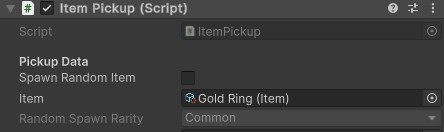
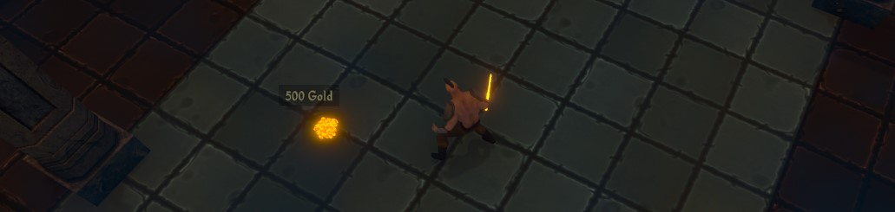
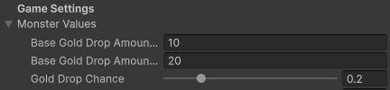
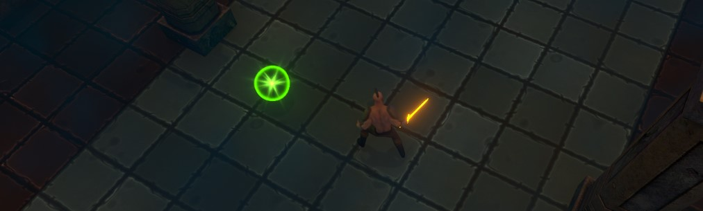
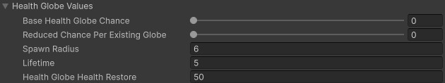

# Pickups
{: .no_toc }
The experience has a variety of pickups which the player will need to collect. Some pickups, such as the items, need to be manually picked up. Others, such as the gold and health pickups, will be automatically collected when the player approaches them.

---
<h2 class="text-delta">Contents</h2>
1. TOC
{:toc}
---

## Item Pickups
Item pickups visually look like treasure chests, and contain an item for the player to pick up. If the player clicks on the item pickup, the player character will move towards it and add it to their inventory.

### Manually Placing Item Pickups
You can manually place item pickups into the environment by dragging the `ItemPickup` prefab into the scene, which can be found at `Assets to Use > Pickups > ItemPickup`in the project folder.

If you select the `ItemPickup`, you can then go to the `ItemPickup` component and choose to either have the item pickup either drop a specific item, or spawn a random item of a given rarity (e.g., have the pickup contain a random legendary).

{: .note }
Placing powerful items into the environment at specific locations can be an effective way of ensuring that players are able to acquire powerful items at very specific points in the game. This helps to maintain balance between players by more closely controlling the power level of players and the quality of their items.

### Placing Item Pickups via Code
If you are using the visual scripting tools, you can place an item pickup into the environment with the `Pickup > Spawn item pickup` action. This will let you choose the location and item which should be spawned.

If you want to place an item pickup via code, you should instead refer to the [ItemPickup class documentation](../documentation/class-itempickup.html) and use the `ItemPickup.Spawn` method instead.

---

## Gold Pickups
Gold pickups visually look like a pile of coins and contain gold for the player to pickup. If the player walks near the pickup, it will disappear and the gold will be added to the player.

### Monster Gold Drops
In the game, each monster you kill has a chance to drop gold in the form of a gold pickup. You can adjust the chance and amount by going to the `GameManager` and opening the `Monster Values` foldout. This will contain a slider for the drop chance and the boundary gold amounts that a standard monster will drop.

Additionally, each monster will have a gold drop modifier, which allows you to adjust the amount of gold each type of monster will drop. This can be found in the `Monster` component for the monsters (see the [Monster](monsters.html) system for information).

### Manually Placing Gold Pickups
Gold can also be manually placed into the level. When doing so, drag the `GoldPickup` prefab (found under `Assets to Use > Pickups > GoldPickup`) into the environment, and enter the gold amount into the `GoldPickup` component.

### Spawning Gold Pickups
The visual scripting system can spawn a gold pickup at a specific location with the specified amount of gold using the `Pickup > Spawn gold pickup` action. 

To spawn a gold pickup via code instead, you can use the GoldPickup.Spawn method instead. See the [GoldPickup](../documentation/class-goldpickup.html) class documentation for details. 

---

## Health Pickups
Health pickups visually look like glowing green orbs. When the player walks over a health globe, it will be destroyed and the player will regain health. Health globes will occasionally spawn when you kill a monster. 

You can adjust the chance for this under the health globe settings, found in the `GameManager` under the `Health Globe Values` foldout.

### Spawning Health Globes
The visual scripting system can spawn a health pickup at a specific location using the `Pickup > Spawn health pickup` action. To spawn a health pickup via code instead, use the `HealthPickup.Spawn` method (see the [HealthPickup](../documentation/class-healthpickup.html) class for details).