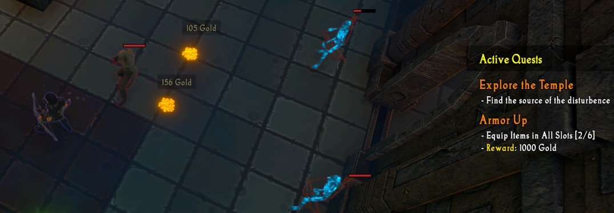

# Quests
{: .no_toc }
In this experience, quests should not be the main focus for your development efforts, but are instead intended to help **guide the player** and **help teach them the mechanics**. For example, quests may prompt the player to equip items, use certain abilities, or collect health pickups.

---
<h2 class="text-delta">Contents</h2>
1. TOC
{:toc}
---

## Quest Overview
Each quest is built from the following information:

1. A quest **name**,
1. A list of quest **requirements**,
1. (optional) A quest reward.

The below image shows an example of the quest window with some in-progress quests.

### Quest Name
Each quest should have a unique quest name. This name appears at the top of the quest information shown in the 'Active Quests' panel on the right of the screen.

### Quest Requirements
Each quest must contain at least one **quest requirement**, but can contain more if needed. These requirements describe to the player what must be done to complete the quest.

Each quest requirement can be given a specific number of **increments**, which represent satges of completion. For example, if a quest has the player kill 10 monsters, killing each monster would increment progress on the quest by one, and the quest would automatically complete when all increments have been filled.

### Quest Rewards
Each quest can also be assigned a **single reward**. This is not required, but if one is set, it will be shown to the player underneath the quest requirements. 

## Implementing Quests
For step-by-step examples of how to implement quests using the visual scripting system, read the [Creating a Quest](../igb190-guides/guide-createquest.html) guide.

For information on how to implement quests and assign them to the player via code, look at the [Code Documentation for Quests](../documentation/quest.html) instead.