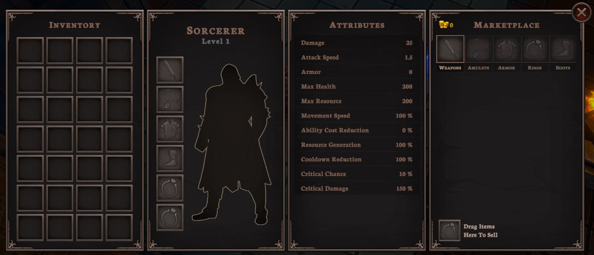
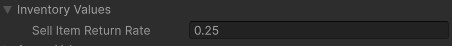

# Character Window and Marketplace
{: .no_toc }
The game provides a character window which allows you to view information about the player character and purchase items through the marketplace. An overview of each of the panels in the character window is discussed below.

---
<h2 class="text-delta">Contents</h2>
1. TOC
{:toc}
---

## Character Window
The player can open the marketplace from the character window. This can be done by pressing either the `C` or `I` keys (shorthand for either "Character" or "Inventory").

The character window will bring up four related panels: 
- the player's **inventory**, 
- the player's **equipment**, 
- the player's **attributes**, 
- and the **marketplace**.

### Inventory Panel
The inventory shows all items that the player currently has in their inventory. Any item that the player picks up will be automatically added to this screen. The player can store a total of `28` items in their inventory at a time. The player can drag these items to reorder them, or drag them into the corresponding slot on their character to equip them.

{: .note }
Placing powerful items into the environment at specific locations can be an effective way of ensuring that players are able to acquire powerful items at very specific points in the game. This helps to maintain balance between players by more closely controlling the power level of players and the quality of their items.

### Equipment Panel
The equipment panel shows the name of the current character, the player's current level, and the equipment that is currently equipped.

### Attributes Panel
This panel shows the current attributes for the player, including any modifiers from gear and any temporary modifiers from buffs or other effects.

{: .note }
When discussing the design of your experience in your final design justification documentation, you should may want to consider how your character differs in the early-game, mid-game, and late-game. Having a way to quickly reference attributes can be very helpful for making calculations to estimate values such as effective damage per second (DPS) and effective health (EH).
 
### Marketplace Panel
To help the player spend gold, the game provides a marketplace. The marketplace allows the player to purchase any item which hasn't specifically been excluded from the list of purchasable items. As the experience is intended to be quite short, this aims to ensure that the player can achieve their "full build" even if they are unlucky and don't get specific drops.

{: .note }
If you don't want the player to always be able to access the marketplace, you can adjust this setting in the `GameManager`. Go to `GameManager > Settings > Show Shop When Character Window Opens`. While this is *possible*, we don't recommend that you do this as you would then need to build further systems to control how and when the shop can appear.

### Selling Items
To provide some worth to all items, regardless of whether the player needs them, the game allows players to sell their existing items. Player's sell an item by dragging it into the '**Sell**' slot in the marketplace. When an item is sold, it gives the player a portion of its purchase price. By default, this is `25%`, but it can be adjusted in the `Inventory Values` foldout of the `GameManager`.

