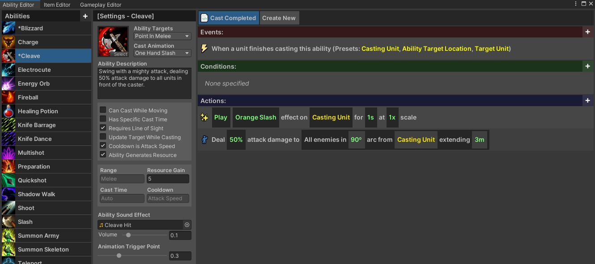
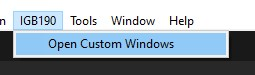

# Ability Editor
{: .no_toc }
The ability editor allows you to create abilities and use custom logic to control the functionality of those abilities.

---
<h2 class="text-delta">Contents</h2>
1. TOC
{:toc}
---

## Test

## Opening the Window
To open the window, go to `IGB190 > Open Custom Windows` in the main Unity toolbar. This will open all of the main windows
in a new window, with each being contained in a seperate tab.

## The Ability List
The ability list is shown on the far left of the window. This shows all of the abilities in the experience.

- **Deleting an Ability**: To delete an ability, right-click on it and select `Delete`.
- **Renaming an Ability**: To rename an ability, right-click on it and select `Rename`.
- **Copying an Ability**: To copy an ability, right-click on it and select `Copy`. This is very useful when creating a new ability which closely matches an existing template.

## Creating a New Ability
You can create a new ability by either right-clicking on an existing ability and selecting `Copy`, or pressing the `+` button in the top-left corner of the window and selecting from a pre-existing template.

## Ability Properties
Select the ability you want to modify by left-clicking on it in the ability list. If there are a lot of abilities in your game, you may need to scroll to find the one you want. When the ability is selected, the rest of the ability window will show information specific to this ability. You can modify these properties to adjust the ability.

### Targeting Properties
The ability targets option determines the targeting requirements for the ability. If the player is the caster, the 'target' is defined by the mouse cursor. If it is a monster, this is determined by their internal logic. The following options exist:

  - None: The ability has no targeting requirements.
  - Unit in Melee: Caster must have a target, and that target must be in melee range.
  - Unit at Range: Caster must have a target, and that target must be in the **specified** range.
  - Point in Melee: Caster will target the closest point that it is in melee range.
  - Point at Ranged: Caster will target the closest point that is in range.

{: .warning }
It can be awkward *requiring* the player to have a target to cast an ability. When designing player abilities, consider using *point* requirements instead.

### Ability Visual Properties
The below visual properties change how the ability sounds, looks, and is presented to the player. They do not change the functionality of the ability in any way.

|Property|Description |
|--------|----------- |
| Cast Animation | This controls the animation that will play when the ability is cast. This does not change the functionality of the ability, only its visuals. | 
| Ability Description | The description for the ability. If this is an ability that the player can have, the description will be shown when hovering over the ability in the UI. |
| Ability Sound Effect | The sound effect that will play when the ability is cast. | 
| Volume | The voume of the sound effect. |
| Animation Trigger Point | Controls when in the animation that the ability should 'activate'. Adjust this so that the ability appears to cast at the correct point for the ability. |

### Ability Functional Properties
The below functional properties control the basic logic for the ability, such as its range and cooldown.

|Property|Description                           |
|--------|-----------                           |
| Can Cast While Moving | If enabled, the unit can continue moving while the cast is in progress. |
| Has Specific Cast Time | By default, abilities have a standardised cast time. You can override this if you want an ability to have a long cast time, or cast very quickly. |
| Requires Line of Sight | If enabled, the unit must be able to 'see' the target to start the cast. |
| Update Target While Casting | If enabled, the target location can change while the ability is being cast. This can make some abilities feel much more responsive, but can also feel awkward on others. |
| Cooldown is Attack Speed | If enabled, the ability cooldown is set to the attack speed of the player. This causes changes to attack speed to also affect the cast rate of the ability. You should use this for the 'main' player abilities. |
| Ability Generates Resource | If enabled, the ability will generate resources instead of spending them. |
| Range | The casting range of the ability (in meters). If the ability needs a melee target or location, it will be set to the melee range of the caster. |
| Resource Cost | Determines the amount of resources the ability costs (or rewards). |
| Cast Time | The cast time of the ability. This will be determined automatically unless the 'Has Specific Cast Time' option is enabled. |
| Cooldown | The cooldown of the ability. This is set automatically if the ability uses attack speed for its cooldown. |

## Creating New Ability Templates
You can create a new ability template by moving (or copying) an ability into the Resources/Templates folder (the abilities can be found in the Resources/Abilities folder). The template abilities do not show up in the Abilities List below, but can be used as a template when creating a new ability with the `+` button.
