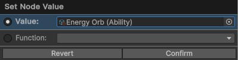
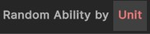
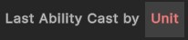

# Ability Nodes
{: .no_toc }
Below is a summary of all the visual scripting nodes which return an ability in the visual scripting system. 

---
<h2 class="text-delta">Contents</h2>
1. TOC
{:toc}
---

### Specify a Specific Ability
If the visual scripting node allows it, you will be able to specify a *specific* ability for the node, rather than using one of the methods below. 

### Ability Nodes

{: .new-title }
> Ability
> 
> 

> 
Random ability on unit

> 
>
> Returns a random ability on the specified unit.
> 

{: .new-title }
> Ability
> 
> 

> 
Last ability cast by unit

> 
>
> Returns the last ability cast by the specified unit.
> 

