# Action Nodes
{: .no_toc }
Below is a summary of all the action nodes in the visual scripting system. These action nodes perform all of the action logic for the visual scripting system.

---
<h2 class="text-delta">Contents</h2>
1. TOC
{:toc}
---

### Action Nodes (Flow)

{: .important-title }
> Action > Flow
> 
> 

> 
Wait

> 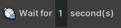
>
> Waits for the specified amount of time before continuing the remaining actions. 
> 

{: .important-title }
> Action > Flow
> 
> 

> 
If statement

> 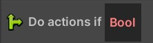
>
> Only executes the nested actions if the given condition is true. 
> 

{: .important-title }
> Action > Flow
> 
> 

> 
While statement

> 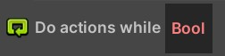
>
> Executes the nested actions while the specified condition is true.
> 

{: .important-title }
> Action > Flow
> 
> 

> 
For statement

> 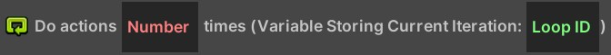
>
> Executes the nested actions a set number of times.
> 

{: .important-title }
> Action > Flow
> 
> 

> 
For each unit in unit group

> 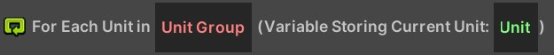
>
> Executes the nested actions for each unit in the specified unit group.
> 

{: .important-title }
> Action > Flow
> 
> 

> 
Disable this script

> 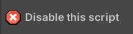
>
> Disables this script, preventing the events from triggering.
> 

{: .important-title }
> Action > Flow
> 
> 

> 
Send event message

> 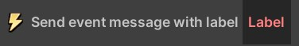
>
> Sends an event message which can be received by the corresponding event message event. This allows you to have one script trigger logic in a secondary script.
> 

### Action Nodes (Unit)
...

### Action Nodes (Player)
...

### Action Nodes (Audio)

{: .important-title }
> Action > Audio
> 
> 

> 
Play audio clip

> 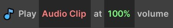
>
> Plays the specified sound effect. **Do not** use this to play game music - use the `Play music` action instead!
> 

{: .important-title }
> Action > Audio
> 
> 

> 
Play music

> 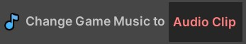
>
> Plays the specified music. **Do not** use this to play sound effects - use the `Play audio clip` action instead!
> 

### Action Nodes (Feedback)
...

### Action Nodes (Projectile)
...

### Action Nodes (Region)

{: .important-title }
> Action > Region
> 
> 

> 
Destroy region

> 
>
> Destroys all regions with the given name (if any exist).
> 

### Action Nodes (Quests)
...

### Action Nodes (Pickups)

{: .important-title }
> Action > Pickups
> 
> 

> 
Spawn item pickup

> 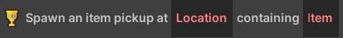
>
> Spawn an item pickup at the specified location which contains the specified item.
> 

{: .important-title }
> Action > Pickups
> 
> 

> 
Spawn gold pickup

> 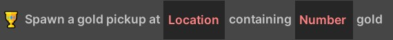
>
> Spawn a gold pickup at the specified location which contains the specified amount of gold.
> 

{: .important-title }
> Action > Pickups
> 
> 

> 
Spawn health pickup

> 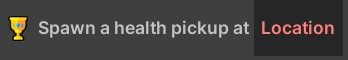
>
> Spawn a health pickup at the specified location.
> 

### Action Nodes (Game State)

{: .important-title }
> Action > Game State
> 
> 

> 
Win game

> 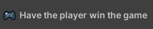
>
> Have the player win the game, taking them to the victory screen.
> 

### Action Nodes (UI Actions)

{: .important-title }
> Action > UI Actions
> 
> 

> 
Show debug message

> 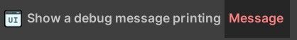
>
> Logs the given message to the game console.
> 

{: .important-title }
> Action > UI Actions
> 
> 

> 
Show in-world status message

> 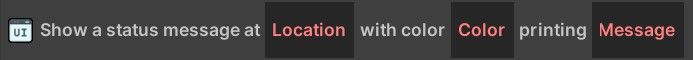
>
> Shows the specified message in world space with the specified text and color (this is how the gold and health messages are implemented!).
> 

{: .important-title }
> Action > UI Actions
> 
> 

> 
Show tutorial message

> 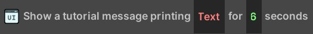
>
> Shows the given message in a tutorial window. This is useful for giving information or instructions to the player.
> 

### Action Nodes (Variables)
...

### Action Nodes (Global Variables)
...
