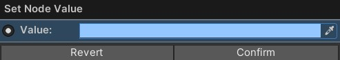

# Color Nodes
{: .no_toc }
Below is a summary of all the visual scripting nodes which return a **color** in the visual scripting system. 

---
<h2 class="text-delta">Contents</h2>
1. TOC
{:toc}
---

### Specify a Specific Color
If the visual scripting node allows it, you will be able to specify a *specific* color for the node, rather than using one of the methods below. 

### Function Nodes
*There are currently no function nodes which return a color, but some may be added in the future (e.g., returning a random color).*