# Condition Nodes
{: .no_toc }
Below is a summary of all the condition/boolean nodes in the visual scripting system. You can use any of these (or a combination of these) when looking to perform condition checks in the visual scripting system.

---
<h2 class="text-delta">Contents</h2>
1. TOC
{:toc}
---

### Region Conditions

{: .new-title }
> Condition > Region
> 
> 

> 
Region exists

> 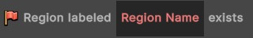
>
> True if a region with the **exact** name currently exists. 
> 

{: .new-title }
> Condition > Region
> 
> 

> 
Unit is in region

> 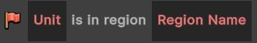
>
> True if the specified unit is currently in a region with the specified name. The name must match the region **exactly**.
> 

### Input Conditions

{: .new-title }
> Condition > Input
> 
> 

> 
Key is held

> 
>
> True if the specified key is currently being held. For simple keys, just enter the key (e.g., enter 'f' if you want to check for the f key being pressed). If you want to check more "complex" keybinds, refer to the lists in the discussion thread [**here**](https://discussions.unity.com/t/c-list-of-string-name-for-input-getkey-string-name/112629/3).
> 

### Unit Group Conditions

{: .new-title }
> Condition > Unit Group
> 
> 

> 
Unit group is empty

> 
>
> True if the specified `Unit Group` contains no units.
> 

{: .new-title }
> Condition > Unit Group
> 
> 

> 
Unit group is not empty

> 
>
> True if the specified `Unit Group` contains at least one units.
> 

{: .new-title }
> Condition > Unit Group
> 
> 

> 
Unit is in unit group

> 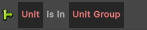
>
> True if the specified `Unit` is contained in the specified `Unit Group`.
> 

{: .new-title }
> Condition > Unit Group
> 
> 

> 
Unit is not in unit group

> 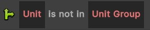
>
> True if the specified `Unit` is **not** contained in the specified `Unit Group`.
> 

### Comparisons

{: .new-title }
> Condition > Comparisons
> 
> 

> 
Or Comparison

> 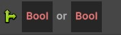
>
> True if **either** (or both) of the specified conditions is true.
> 

{: .new-title }
> Condition > Comparisons
> 
> 

> 
And Comparison

> 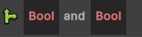
>
> True if **both** of the specified conditions are true.
> 

{: .new-title }
> Condition > Comparisons
> 
> 

> 
Bool Comparison

> 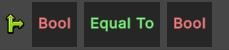
>
> Compares two Boolean conditions and checks them against the assigned operator (`Equal to`, or `Not Equal To`).
> 

{: .new-title }
> Condition > Comparisons
> 
> 

> 
Bool Comparison

> 
>
> Compares two Boolean conditions and checks them against the assigned operator (`Equal to`, or `Not Equal To`).
> 

{: .new-title }
> Condition > Comparisons
> 
> 

> 
Number Comparison

> 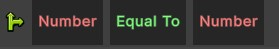
>
> Compares two numbers and checks them against the assigned operator (`Equal to`, or `Not Equal To`, `Greater Than`, `Less Than`, `Greater Than or Equal To`, `Less Than or Equal To`).
> 

{: .new-title }
> Condition > Comparisons
> 
> 

> 
Vector Comparison

> 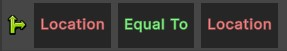
>
> Compares two vectors/positions and checks them against the assigned operator (`Equal to`, or `Not Equal To`).
> 

{: .new-title }
> Condition > Comparisons
> 
> 

> 
Ability Comparison

> 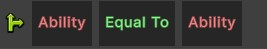
>
> Compares two abilities and checks them against the assigned operator (`Equal to`, or `Not Equal To`).
> 

{: .new-title }
> Condition > Comparisons
> 
> 

> 
Text Comparison

> 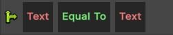
>
> Compares two pieces of text and checks them against the assigned operator (`Equal to`, or `Not Equal To`).
> 

{: .new-title }
> Condition > Comparisons
> 
> 

> 
Unit Comparison

> 
>
> Compares two units and checks them against the assigned operator (`Equal to`, or `Not Equal To`).
> 

### Unit

{: .new-title }
> Condition > Unit
> 
> 

> 
Unit matches template

> 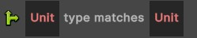
>
> Returns true if the specified unit matches the specified template. This is useful for checking the "type" of unit - e.g., a Skeleton Archer.
> 

{: .new-title }
> Condition > Unit
> 
> 

> 
Unit is moving

> 
>
> Returns true if the specified unit is currently moving (this does **not** include unit movement through the `Unit > Move Over Time` action, only standard movement).
> 

{: .new-title }
> Condition > Unit
> 
> 

> 
Unit is stationary

> 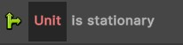
>
> Returns true if the specified unit is **not** currently moving (this does **not** check for movement through the `Unit > Move Over Time` action, only 'standard' movement).
> 

{: .new-title }
> Condition > Unit
> 
> 

> 
Unit is casting

> 
>
> Returns true if the specified unit is currently casting an ability.
> 

{: .new-title }
> Condition > Unit
> 
> 

> 
Unit can move

> 
>
> Returns true if the specified unit **could** currently move.
> 

{: .new-title }
> Condition > Unit
> 
> 

> 
Unit has buff

> 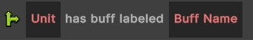
>
> Returns true if the specified unit has a buff with the specified name. This buff name must match a buff exactly (this is case sensitive).
> 

{: .new-title }
> Condition > Unit
> 
> 

> 
Unit is stunned

> 
>
> Returns true if the specified unit is currently stunned.
> 

{: .new-title }
> Condition > Unit
> 
> 

> 
Unit ability is on cooldown

> 
>
> Returns true if the specified ability for the specified unit is currently on cooldown.
> 

{: .new-title }
> Condition > Unit
> 
> 

> 
Unit can cast ability

> 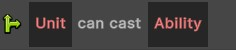
>
> Returns true if the specified ability for the specified unit could currently be cast. This may be because the unit lacks resources, is already casting, etc.
> 

{: .new-title }
> Condition > Unit
> 
> 

> 
Unit is empowered

> 
>
> Returns true if the specified unit is currently empowered. Only monsters can be empowered.
> 

{: .new-title }
> Condition > Unit
> 
> 

> 
Unit has tag

> 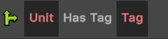
>
> Returns true if the specified unit has the specified tag. This must match the unit tag exactly.
> 

### Quests

{: .new-title }
> Condition > Quest
> 
> 

> 
Quest is active

> 
>
> Returns true if a quest with the specified name is currently active for the player.
> 

{: .new-title }
> Condition > Quest
> 
> 

> 
Quest has been completed

> 
>
> Returns true if a quest with the specified name has been completed by the player.
> 

### Player

{: .new-title }
> Condition > Player
> 
> 

> 
Player has item equipped

> 
>
> Returns true if the player currently has the specified item equipped.
> 

{: .new-title }
> Condition > Player
> 
> 

> 
Player has item in inventory

> 
>
> Returns true if the player currently has the specified item in their inventory. This can be useful for checking if the player is holding a key or other object.
> 

### Variables

{: .new-title }
> Condition > Variables
> 
> 

> 
Boolean Variable

> 
>
> Returns the value of a Boolean variable with the given name. This variable is local to the "group" of scripts - i.e., the variable will be shared by all of the scripts used by the ability or item.
> 

{: .new-title }
> Condition > Variables
> 
> 

> 
Global Boolean Variable

> 
>
> Returns the value of a Boolean variable with the given name. This variable is global to the entire application.
> 
