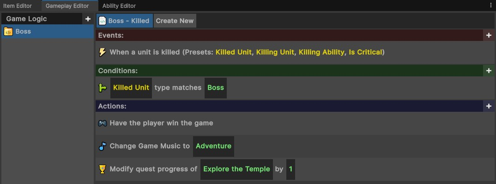

# General Editor
{: .no_toc }
The general editor in the visual coding system allows you to add general logic to your experience, that isn't specific to an ability, item, or other specific component. 

It can be used to create bespoke tutorialisation, events, or custom gameplay logic that your experience may require.

---
<h2 class="text-delta">Contents</h2>
1. TOC
{:toc}
---

## Opening the General Editor
To open the General Editor, go to the top menu bar, and select `IGB190 > Open Custom Windows`.

{: .important-title }
> Script Explanation
>
> In the above example, the script handles the logic for when the boss is killed. When a unit is killed, the script checks to see if it is the boss, and if so, it performs some actions: first it flags that the player has won the game, then it changes the game music and completes a quest.

## General Editor Recommendations
On the left you can create new "Game Logic Blocks", with each containing a collection of visual scripts. For this reason, it is recommended that you group related logic into the same game logic block. For example, you may want to have **one block per quest**, **one block per tutorial stage**, or for each **unique game system**. 

This isn't *required*, but it will make the code for your game much easier to manage as you get further into development.

