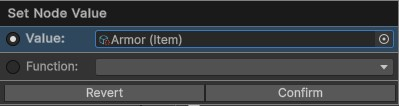
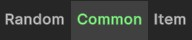

# Item Nodes
{: .no_toc }
Below is a summary of all the visual scripting nodes which return an item in the visual scripting system. You can use any of these (or a combination of these) when specifying an item.

---
<h2 class="text-delta">Contents</h2>
1. TOC
{:toc}
---

### Specify a Specific Item
If the visual scripting node allows it, you will be able to specify a *specific* item for the node, rather than using one of the methods below. 

### Item Nodes

{: .new-title }
> Item
> 
> 

> 
Random item of rarity

> 
>
> Returns a random item with the specified rarity.
> 

