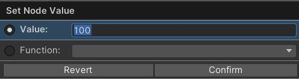
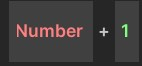
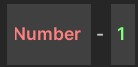
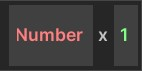
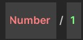
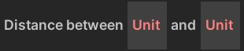

# Number Nodes
{: .no_toc }
Below is a summary of all the visual scripting nodes which return a **number** in the visual scripting system. 

---
<h2 class="text-delta">Contents</h2>
1. TOC
{:toc}
---

### Specify a Specific Number
If the visual scripting node allows it, you will be able to specify a *specific* number for the node, rather than using one of the methods below (e.g., dealing an exact amount of damage). 

### Number Nodes (Player)

{: .note-title }
> Number > Player
> 
> 

> 
Player level

> 
>
> Returns the current player level.
> 

{: .note-title }
> Number > Player
> 
> 

> 
Player gold

> 
>
> Returns the amount of gold the player currently has.
> 

{: .note-title }
> Number > Player
> 
> 

> 
Player items equipped

> 
>
> Returns the number of items the player currently has equipped.
> 

### Number (Time)

{: .note-title }
> Number > Time
> 
> 

> 
Time since level start

> Returns the amount of time in seconds since the level started.
> 

{: .note-title }
> Number > Time
> 
> 

> 
Delta time

> Returns the amount of time spent rendering the frame.
> 

{: .note-title }
> Number > Time
> 
> 

> 
Fixed delta time

> Returns the amount of time between physicis timesteps.
> 

### Number (Math)

{: .note-title }
> Number > Math
> 
> 

> 
Addition

> 
>
> Returns the result of two numbers being added together.
> 

{: .note-title }
> Number > Math
> 
> 

> 
Subtraction

> 
>
> Returns the result of one number being subtracted from another.
> 

{: .note-title }
> Number > Math
> 
> 

> 
Multiplication

> 
>
> Returns the result of two numbers being multiplied together.
> 

{: .note-title }
> Number > Math
> 
> 

> 
Division

> 
>
> Returns the result of one number being divided by another.
> 

{: .note-title }
> Number > Math
> 
> 

> 
Distance between points

> 
>
> Returns the distance between two points.
> 

{: .note-title }
> Number > Math
> 
> 

> 
Distance between units

> 
>
> Returns the distance between two units.
> 

{: .note-title }
> Number > Math
> 
> 

> 
Vector component

> 
>
> Returns a specific component from a vector (e.g., the X, Y, or Z component).
> 

### Number Nodes (Random)

{: .note-title }
> Number > Random
> 
> 

> 
Random number

> 
>
> Returns a random number between two values.
> 

### Number Nodes (Unit)

{: .note-title }
> Number > Unit
> 
> 

> 
Unit health

> 
>
> Returns the current health of the specified unit.
> 

{: .note-title }
> Number > Unit
> 
> 

> 
Unit max health

> 
>
> Returns the maximum health of the specified unit.
> 

{: .note-title }
> Number > Unit
> 
> 

> 
Unit health percent

> 
>
> Returns the current health percent of the unit (e.g., 40 = 40% health).
> 

{: .note-title }
> Number > Unit
> 
> 

> 
Unit resource

> 
>
> Returns the current resource of the specified unit.
> 

{: .note-title }
> Number > Unit
> 
> 

> 
Unit max resource

> 
>
> Returns the maximum resource of the specified unit.
> 

{: .note-title }
> Number > Unit
> 
> 

> 
Unit resource percent

> 
>
> Returns the current resource percent of the unit (e.g., 40 = 40% resource).
> 
    

### Number (Unit Group)

{: .note-title }
> Number > Unit Group
> 
> 

> 
Count units in unit group

> 
>
> Returns the number of units in the specified unit group.
> 
  

### Number (Variables)

{: .note-title }
> Unit > Variable
> 
> 

> 
Number variable

> 
>
> Returns the number stored in the variable with the given name. This variable is shared between all scripts in the same "block" (e.g., ability/item).
> 

{: .note-title }
> Unit > Variable
> 
> 

> 
Global number variable

> 
>
> Returns the number stored in the global variable with the given name. This variable is shared across the entire application.
> 
