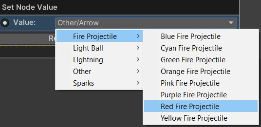

# Other Nodes
{: .no_toc }
Below is a summary of all the visual scripting nodes which return an option from a dropdown in the visual scripting system. No function nodes are available for these.

---
<h2 class="text-delta">Contents</h2>
1. TOC
{:toc}
---

## Projectile Nodes
When specifying a projectile, a projectile node will let you choose from all of the valid projectiles which exist in your project.

---

## Visual Effect Nodes
When specifying a visual effect, a visual effect node will let you choose from all valid visual effects which exist in your project.

---

## Stat Nodes
When specifying a unit stat (e.g., movement speed), the stat node will let you choose from a list of all valid stats in the project. By default, the following options are allowed:

