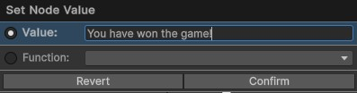
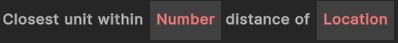
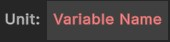
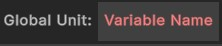

# String Nodes
{: .no_toc }
Below is a summary of all the visual scripting nodes which return a **string** in the visual scripting system. 

---
<h2 class="text-delta">Contents</h2>
1. TOC
{:toc}
---

### Specify a Specific String
If the visual scripting node allows it, you will be able to specify a *specific* string for the node, rather than using one of the methods below. 

### String Nodes

{: .note-title }
> String
> 
> 

> 
Name of Unit

> 
>
> Returns the name of the given unit. Note that its name is specified by the `unitName`, and is not the name of the prefab which you see when selecting the unit from the dropdown.
> 

{: .note-title }
> String
> 
> 

> 
Name of Ability

> 
>
> Returns the name of the given ability.
> 

{: .note-title }
> String
> 
> 

> 
Tag of Ability

> 
>
> Returns the tag of the given ability.
> 

{: .note-title }
> String
> 
> 

> 
Tag of Item

> 
>
> Returns the tag of the given item.
> 

{: .note-title }
> String
> 
> 

> 
Combine Strings

> 
>
> Combines two strings together using string concatenation.
> 

### Unit Nodes (Variables)

{: .note-title }
> String > Variable
> 
> 

> 
String variable

> 
>
> Returns the string stored in the variable with the given name. This variable is shared between all scripts in the same "block" (e.g., ability/item).
> 

{: .note-title }
> String > Variable
> 
> 

> 
Global String variable

> 
>
> Returns the string stored in the global variable with the given name. This variable is shared across the entire application.
> 
