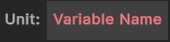

# Unit Nodes
{: .no_toc }
Below is a summary of all the visual scripting nodes which return a unit in the visual scripting system. 

---
<h2 class="text-delta">Contents</h2>
1. TOC
{:toc}
---

### Specify a Specific Unit
If the visual scripting node allows it, you will be able to specify a *specific* unit for the node, rather than using one of the methods below (e.g., when spawning a unit). 

### Unit Nodes (Distance)

{: .new-title }
> Unit > Distance
> 
> 

> 
Closest unit near point

> 
>
> Returns the closest unit to the specified point (within the maximum distance).
> 

{: .new-title }
> Unit > Distance
> 
> 

> 
Furthest unit near point

> 
>
> Returns the furthest unit to the specified point (within the maximum distance).
> 

{: .new-title }
> Unit > Distance
> 
> 

> 
Closest unit near unit

> 
>
> Returns the closest unit to the specified unit (within the maximum distance).
> 

{: .new-title }
> Unit > Distance
> 
> 

> 
Furthest unit near unit

> 
>
> Returns the furthest unit to the specified unit (within the maximum distance).
> 

### Unit Nodes (Random)

{: .new-title }
> Unit > Random
> 
> 

> 
Random unit near point

> 
>
> Returns a random unit within a given distance of a given unit.
> 

{: .new-title }
> Unit > Random
> 
> 

> 
Random unit near point

> 
>
> Returns a random unit within a given distance of a given point.
> 

### Unit Nodes (Variables)

{: .new-title }
> Unit > Variable
> 
> 

> 
Unit variable

> 
>
> Returns the unit stored in the variable with the given name. This variable is shared between all scripts in the same "block" (e.g., ability/item).
> 

{: .new-title }
> Unit > Variable
> 
> 

> 
Global Unit variable

> 
>
> Returns the unit stored in the global variable with the given name. This variable is shared across the entire application.
> 

### Unit Nodes (Other)

{: .new-title }
> Unit > Other
> 
> 

> 
Unit with label

> 
>
> Returns the unit in the scene which has the given label. If multiple units have the same label, it will return a random unit.
> 
