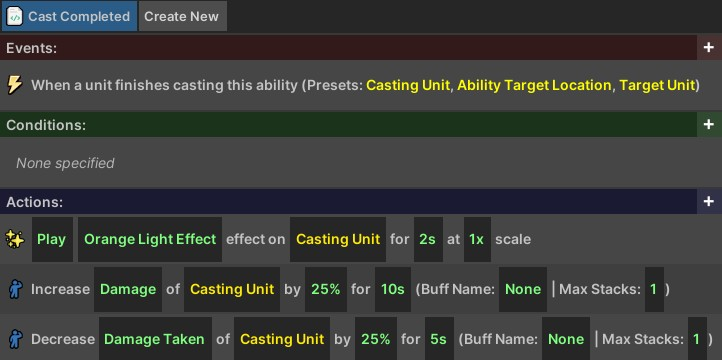

# Visual Coding
{: .no_toc }
In this guide, you will learn how to set dress an environment to make the space feel more natural and unique. This is especially beneficial when the space has been created using a small set of generic tiles.

---
<h2 class="text-delta">Contents</h2>
1. TOC
{:toc}
---

## Visual Coding Structure
The visual coding system can be used to define custom logic for the experience without needing to write C# code. Visual Code Scripts follow an **Event**, **Condition**, **Action** structure.

- The **Event** controls when the logic will activate.
- The **Conditions** can be used to create aditional activation requirements.
- The **Actions** control what the script will do.

Custom visual code can be added to specific items using the [Item Editor](item-editor.html), to abilities with the [Ability Editor](ability-editor.html), or to the game more generally with the [General Script Editor](general-editor.html).

Below is an example showing the visual code for the **War Cry** ability. When the ability containing this script is cast, it spawns a visual effect on the caster, then their damage dealt is increased by 25% and damage taken is decreased by 25% for 10 seconds.

## Creating Scripts

| **Events** |
| When a unit begins casting this ability |
| When a unit finishes casting this ability |

| **Actions** |
| Wait | Wait for [NUMBER] seconds. |
| If Statement | Do actions if [BOOL] |
| While Statement | Do actions while [BOOL] |

## Variable Types
- **TEXT**: Plain text.
- **NUMBER**: A decimal number.
- **ABILITY**: An ability object.
- **ITEM**: An item object.
- **PROJECTILE**: 
- **AUDIO CLIP**: A sound file.
- **UNIT**: A single unit.
- **UNIT GROUP**: A group of units (could be empty).
- **EFFECT**: A particle effect which can be spawned.
- **POSITION**: A Vector representing a position.
- **OPTION**: Select from a preset list (e.g., the exact stat that should be modified).

## Deleting and Renaming Scripts

## Events

#### When a unit begins casting this ability

|**Type** | **Variable** |**Description** |
|float | healthPickedUp | The amount of health that was picked up. |

The
