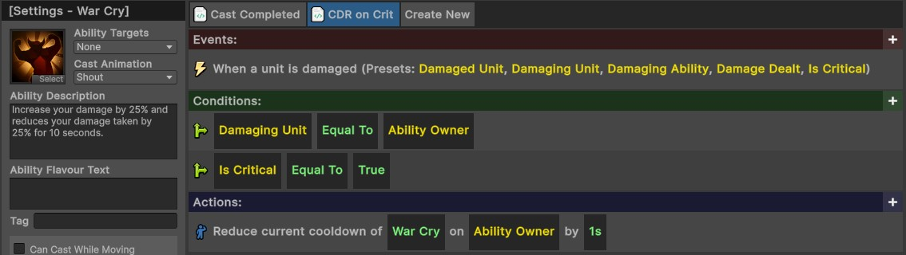
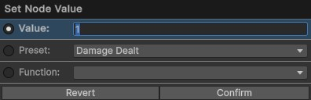

# Visual Coding
{: .no_toc }
The IGB190 project provides a visual coding system which aims to help you implement item and ability logic more easily, without the need for extensive code knowledge. It provides many features which provide easy functionality to game-specific logic and visual effects.

This page provides an overview of the system, with additional information about each component being explored further on the individual sub-pages.

---
<h2 class="text-delta">Contents</h2>
1. TOC
{:toc}
---

## Opening the Visual Code Editors
To open the visual code editors, go to the top Unity menu window and select `IGB190 > Open Custom Windows`. This will open the [**Ability Editor**](ability-editor.html), [**Item Editor**](item-editor.html), and [**General Script Editor**](general-editor.html). For details about each specific window, see their individual pages.

Each of these editors stores visual coding logic. For example, go to the **Ability Editor** and select an ability from the left menu. This will allow you to visually edit properties of the ability, and on the right, you will be able to use the visual script editor to change the functionality of the ability.

All of the logic for the abilities and items in the IGB190 Base Project were built using the visual scripting system - no custom logic was implemented. If you want to get a better understanding of how the system works, you may find it useful to view the implementation of the existing abilities.

---

## Visual Coding Structure
The visual coding system can be used to define custom logic for the experience without needing to write C# code. Visual Code Scripts follow an **Event**, **Condition**, **Action** structure.

- The **Event** controls when the logic will activate.
- The **Conditions** can be used to create aditional activation requirements.
- The **Actions** control what the script will do.

Custom visual code can be added to specific items using the [Item Editor](item-editor.html), to abilities with the [Ability Editor](ability-editor.html), or to the game more generally with the [General Script Editor](general-editor.html).

Below is an example showing the visual code for the **War Cry** ability. When the ability containing this script is cast, it spawns a visual effect on the caster, then their damage dealt is increased by 25% and damage taken is decreased by 25% for 10 seconds.

---

## Adding Scripts
Each ability or item in the visual coding system can contain **multiple scripts**. In the above example, there is only one script which triggers when the ability is cast. Some abilities, however, may require multiple scripts. For example, imagine that the War Cry ability had a secondary effect: whenever the player critically hits an enemy, the cooldown is reduced by one second.

This can be handled by adding a new script by pressing the `Create New` button at the top of the image. Then, you can implement the required custom logic to implement the remainder of the ability logic.

{: .note }
> A similar approach is used for all ranged attacks which fire a projectile. The first script checks for when the ability is cast, and spawns an appropriate projectile. The second script checks for when that projectile collides with an enemy and performs appropriate actions.

---

## Node Logic
This visual scripting system uses a block-based (or node-based) approach for defining logic. The system has pre-defined events, conditions, and actions, but each of these can contain dynamic nodes. For example, in the above script, an action node is reducing the cooldown of an ability, but there are three dynamic nodes:

1. The ability cooldown to reduce (in this case, War Cry)
2. The unit who has the ability
3. The amount that the cooldown should be reduced by (in seconds)

You can click on any of these dynamic nodes to enter an appropriate value. Each of these nodes has a specific type (e.g., the first node here must be an *ability*, the second must be a *unit*, and the third must be an *amount*). When choosing an appropriate value for the node, you usually have three options:

1. Enter an exact value (e.g., the duration of 1 second, or the *exact* War Cry ability). These are usually shown in **green**.
1. Enter a preset (e.g., the 'Ability Owner', or the 'Damaged Unit'). The presets available are usually determined by the event which triggered the logic. E.g., we can only refer to the `Damaging Unit` here because the `Unit is damaged` event was triggered. These are usually shown in **yellow**.
1. Enter a function (e.g., instead of choosing to reduce the cooldown of War Cry, we could have made this node return a *random ability* on the ability owner instead). Function nodes create additional nodes inside the current node.

An example showing the options when the '`1s`' block is clicked is shown below. Currently, this is set to use a specific value of 1, but could be adjusted to use a preset (e.g., reducing the cooldown by the amount of damage dealt, or a function instead).

---

## Node Types
Below is a list of all common types of nodes you may encounter when using the visual scripting system. The type of node should be self-evident from its description (e.g., an action may read as "Spawn **[Unit]** at **[Location]**). In this case, it is clear that the first block will require you to specify a unit and the second block will require you to specify a location.

| **Node Type** | **Description** |
| Text | Resolves to plain text. (e.g., for displaying a message on the screen). |
| Number | Resolves to a decimal number. (e.g., for choosing how much gold to give the player). |
| Ability | Resolves to an ability (e.g., for checking whether a specific ability killed an enemy). |
| Item | Resolves to an item (e.g., for choosing which item to drop). |
| Projectile | Resolves to a projectile (e.g., for choosing which projectile to spawn). |
| Audio Clip | Resolves to an Audio Clip (e.g., for choosing what sound to play). |
| Unit | Resolves to a Unit (e.g., for choosing which unit to damage). |
| Unit Group | Resolves to a group of units (which could be empty). |
| Effect | Resolves to a visual effect (e.g., for choosing which visual to spawn). |
| Position | Resolves to a position (e.g., for choosing where to spawn a unit). |
| Option | Resolves to an option from a dropdown. E.g., choosing which stat a buff should affect. |

## Complete Node List
The visual scripting system contains a large number of nodes. Each of these has been listed on their own pages, alongside relevant documentation.

Core Root Nodes:
- [Event Nodes](event-nodes.html)
- [Condition Nodes](condition-nodes.html)
- [Action Nodes](action-nodes.html)

Nodes which return a specific type:
- [Unit Nodes](unit-nodes.html)
- [Number Nodes](number-nodes.html)
- [String Nodes](string-nodes.html)
- [Item Nodes](item-nodes.html)
- [Ability Nodes](ability-nodes.html)
- [Color Nodes](color-nodes.html)
- [Other Nodes](other-nodes.html)

## Deleting or Renaming Scripts
To delete or rename a script, right click on the script and select the appropriate option. 

## Visual Scripting Shortcuts
The visual scripting system uses some very rudimentary shortcuts. It provides limited `Copy+Paste` functionality, `Undo` functionality, and allows you to delete or reorder root nodes.