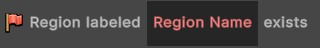

# Visual Coding
{: .no_toc }
In this guide, you will learn how to set dress an environment to make the space feel more natural and unique. This is especially beneficial when the space has been created using a small set of generic tiles.

---
<h2 class="text-delta">Contents</h2>
1. TOC
{:toc}
---

## Visual Coding Structure
The visual coding system can be used to define custom logic for the experience without needing to write C# code. Visual Code Scripts follow an **Event**, **Condition**, **Action** structure.

- The **Event** controls when the logic will activate.
- The **Conditions** can be used to create aditional activation requirements.
- The **Actions** control what the script will do.

Custom visual code can be added to specific items using the [Item Editor](item-editor.html), to abilities with the [Ability Editor](ability-editor.html), or to the game more generally with the [General Script Editor](general-editor.html).

Below is an example showing the visual code for the **War Cry** ability. When the ability containing this script is cast, it spawns a visual effect on the caster, then their damage dealt is increased by 25% and damage taken is decreased by 25% for 10 seconds.

---

## Events
Below is a summary of all the events in the visual scripting system, with a short summary of each and an outline of any associated preset values which will be populated from the event.

### Ability Events

{: .highlight }
> 

> 
When a unit begins casting this ability

> This event will only trigger if it is attached to an ability, and will only trigger for the unit that cast the ability. It will trigger when the ability **starts** casting. If you want to handle the ability cast logic, it is recommended you use the `When a unit finishes casting this ability` event instead.
>
> The event populates the following preset values:
> - **Casting Unit** (Unit): The unit that cast the ability.
> - **Ability Target Location** (Location): The location that the ability should be cast at.
> - **Target Unit** (Unit): The target unit for the ability (only exists if the ability targets a specific unit).
> 

{: .highlight }
> 

> 
When a unit finishes casting this ability

> This event will only trigger if it is attached to an ability, and will only trigger for the unit that cast the ability. It will trigger when the ability **finishes** casting, and is the main event you should use to execute logic when coding the logic for an ability cast.
>
> The event populates the following preset values:
> - **Casting Unit** (Unit): The unit that cast the ability.
> - **Ability Target Location** (Location): The location that the ability should be cast at.
> - **Target Unit** (Unit): The target unit for the ability (only exists if the ability targets a specific unit).
> 

### Time Events

{: .highlight }
> 

> 
On script loaded

> This event will trigger when the script is loaded. The script is *loaded* when the logic should start being 'checked'. If the script is attached to an ability, this will either be triggered when the unit spawns, or the ability is added to the unit. If the script is attached to an item, it is triggered when the item is equipped. If the script is attached to a general script, it will be triggered when the game begins. This event is often used to handle setup logic.
>
> The event populates no preset values.
> 

{: .highlight }
> 

> 
On script unloaded

> This event will trigger when the script is unloaded. The script is *unloaded* when the logic should stop being 'checked'. If the script is attached to an ability, this will either be triggered when the unit dies, or the ability is removed from the unit. If the script is attached to an item, it is triggered when the item is unequipped.
>
> The event populates no preset values.
> 

{: .highlight }
> 

> 
Do every frame

> This event will trigger **every game frame**. This can be very powerful if you need to constantly check if something has happened, but should be avoided if you are executing complex game logic (e.g., don't spawn visual effects every frame).
>
> The event populates no preset values.
> 

{: .highlight }
> 

> 
Do after X seconds

> This event will trigger a specific amount of time after the script is first loaded, and then won't trigger again. You can specify the exact amount of time in the number node on the event.
>
> The event populates no preset values.
> 

{: .highlight }
> 

> 
Do every X seconds

> This event will repeatedly trigger, with a delay between each execution. Specify the exact amount of time to delay between executions in the number node on the event.
>
> The event populates no preset values.
> 

### Unit Events

{: .highlight }
> 

> 
Unit is killed

> This event is triggered every time a unit is killed, regardless of faction or how it was killed (e.g., it could be an ally, a monster, or the player itself).
>
> The event populates the following preset values:
> - **Killed Unit** (Unit): The unit that was killed.
> - **Killing Unit** (Unit): The unit that killed the dying unit.
> - **Killing Ability** (Ability): The ability that killed the dying unit.
> - **Is Critical** (Boolean): True if the ability was a critical, otherwise False.
> 

{: .highlight }
> 

> 
Unit is damaged

> This event is triggered every time a unit is damaged, regardless of faction or how it was damaged (e.g., it could be an ally, a monster, or the player itself).
>
> The event populates the following preset values:
> - **Damaged Unit** (Unit): The unit that was damaged.
> - **Damaging Unit** (Unit): The unit that damaged the dying unit.
> - **Damaging Ability** (Ability): The ability that damaged the damaged unit.
> - **Damage Dealt** (Number): The amount of damage done by the ability.
> - **Is Critical** (Boolean): True if the ability was a critical, otherwise False.
> 

{: .highlight }
> 

> 
Unit is healed

> This event is triggered every time a unit is healed, regardless of faction or how it was healed (e.g., it could be an ally, a monster, or the player itself).
>
> The event populates the following preset values:
> - **Healed Unit** (Unit): The unit that was healed.
> - **Healing Unit** (Unit): The unit that healed the unit.
> 

{: .highlight }
> 

> 
Unit gains resource

> This event is triggered every time a unit gains resource (except from base regeneration).
>
> The event populates the following preset values:
> - **Triggering Unit** (Unit): The unit that gained sources.
> - **Resources Gained** (Number): The amount of resources gained.
> 

{: .highlight }
> 

> 
Unit loses resource

> This event is triggered every time a unit loses resource.
>
> The event populates the following preset values:
> - **Triggering Unit** (Unit): The unit that lost sources.
> - **Resources Gained** (Number): The amount of resources lost.
> 

### Player Events

{: .highlight }
> 

> 
Player gains experience

> This event is triggered every time the player gains experience.
>
> The event does not populate any preset values.
> 

{: .highlight }
> 

> 
Player gains a level

> This event is triggered every time the player gains a level.
>
> The event does not populate any preset values.
> 

{: .highlight }
> 

> 
Player sells an item

> This event is triggered every time the player sells an item through the shop.
>
> The event populates the following preset values:
> - **Triggering Item** (Unit): The item that was sold.
> 

{: .highlight }
> 

> 
Player buys an item

> This event is triggered every time the player buys an item through the shop.
>
> The event populates the following preset values:
> - **Triggering Item** (Unit): The item that was purchased.
> 

{: .highlight }
> 

> 
Player equips an item

> This event is triggered every time the player equips an item.
>
> The event populates the following preset values:
> - **Triggering Item** (Unit): The item that was equipped.
> 

{: .highlight }
> 

> 
Player unequips an item

> This event is triggered every time the player unequips an item.
>
> The event populates the following preset values:
> - **Triggering Item** (Unit): The item that was unequipped.
> 

{: .highlight }
> 

> 
Player picks up gold

> This event is triggered every time the player picks up gold.
>
> The event populates the following preset values:
> - **Gold Added** (Number): The amount of gold collected.
> 

{: .highlight }
> 

> 
Player picks up a health globe

> This event is triggered every time the player picks up a health globe.
>
> The event populates the following preset values:
> - **Health Restored** (Number): The amount of health restored.
> 

### Region Events

{: .highlight }
> 

> 
Unit enters region

> This event is triggered when the player enters a region with a specific name. Use the text slot in the event to specify the exact region name. This must match the name on the region **exactly**.
>
> The event does not populate any preset values.
> 

{: .highlight }
> 

> 
Unit leaves region

> This event is triggered when the player leave a region with a specific name. Use the text slot in the event to specify the exact region name. This must match the name on the region **exactly**.
>
> The event does not populate any preset values.
> 

### Projectile Events

{: .highlight }
> 

> 
Projectile collides with an enemy

> This event is triggered when a projectile spawned by this ability or item collides with an enemy of its owner. Note that for optimisation purposes, you cannot use this event to check if a projectile created from *another source* collided with an enemy. **exactly**.
>
> The event populates the following preset values:
> - **Event Projectile** (Projectile): The projectile that collided.
> - **Casting Unit** (Unit): The unit that created the projectile.
> - **Colliding Unit** (Unit): The unit that was hit by the projectile.
> 

{: .highlight }
> 

> 
Projectile times out

> This event is triggered when a projectile spawned by this ability or item exceeds its assigned lifetime. Note that you must have first assigned a lifetime to the projectile via the `Projectile > Set Lifetime` action. **exactly**.
>
> The event populates the following preset values:
> - **Event Projectile** (Projectile): The projectile that is timing out.
> - **Casting Unit** (Unit): The unit that created the projectile.
> 

{: .highlight }
> 

> 
Projectile reaches its goal

> This event is triggered when a projectile spawned by this ability reaches its goal. This only triggers if the projectile was assigned a goal location, via the `Projectile > Move Projectile Towards Point` action.
>
> The event populates the following preset values:
> - **Event Projectile** (Projectile): The projectile that is timing out.
> - **Casting Unit** (Unit): The unit that created the projectile.
> - **Goal Position** (Location): The final gloal location.
> - **Goal Unit** (Unit): The goal unit. This is only assigned if the projectile was assigned to move towards a specific unit.
> 

{: .highlight }
> 

> 
Projectile collides with terrain

> This event is triggered when a projectile spawned by this ability/item collides with terrain (e.g., a wall).
>
> The event populates the following preset values:
> - **Event Projectile** (Projectile): The projectile that collided with terrain.
> - **Casting Unit** (Unit): The unit that created the projectile.
> 

### Quest Events

{: .highlight }
> 

> 
On quest received

> This event is triggered when the player receives a specific quest. Use the text slot in the event to specify the exact quest name. This must match the name of the quest **exactly**.
>
> The event does not populate any preset values.
> 

{: .highlight }
> 

> 
On quest completed

> This event is triggered when the player completes a specific quest. Use the text slot in the event to specify the exact quest name. This must match the name of the quest **exactly**.**exactly**.
>
> The event does not populate any preset values.
> 

### Input Events

{: .highlight }
> 

> 
On key down

> This event is triggered when the player presses a specific key. Use the text slot in the event to specify the exact key. For simple keys, just enter the key (e.g., enter 'f' if you want to check for the f key being pressed). If you want to check more "complex" keybinds, refer to the lists in the discussion thread [**here**](https://discussions.unity.com/t/c-list-of-string-name-for-input-getkey-string-name/112629/3).
>
> The event does not populate any preset values.
> 

{: .highlight }
> 

> 
On key up

> This event is triggered when the player releases a specific key. Use the text slot in the event to specify the exact key. For simple keys, just enter the key (e.g., enter 'f' if you want to check for the f key being pressed). If you want to check more "complex" keybinds, refer to the lists in the discussion thread [**here**](https://discussions.unity.com/t/c-list-of-string-name-for-input-getkey-string-name/112629/3).
>
> The event does not populate any preset values.
> 

{: .highlight }
> 

> 
On key held

> This event is triggered when the player every frame while they are holding a specific key. Use the text slot in the event to specify the exact key. For simple keys, just enter the key (e.g., enter 'f' if you want to check for the f key being pressed). If you want to check more "complex" keybinds, refer to the lists in the discussion thread [**here**](https://discussions.unity.com/t/c-list-of-string-name-for-input-getkey-string-name/112629/3).
>
> The event does not populate any preset values.
> 

## Conditions

### Region Conditions

{: .new-title }
> Condition
> 
> 

> 
Region exists

> 
>
> True if a region with the **exact** name currently exists. 
> 

{: .new-title }
> Condition
> 
> 

> 
Unit is in region

> 
>
> True if the specified unit is currently in a region with the specified name. The name must match the region **exactly**.
> 

|Time |
| On Script Loaded | N/A |
| On script unloaded   test | |

| **Actions** |
| Wait | Wait for [NUMBER] seconds. |
| If Statement | Do actions if [BOOL] |
| While Statement | Do actions while [BOOL] |

## Variable Types
- **TEXT**: Plain text.
- **NUMBER**: A decimal number.
- **ABILITY**: An ability object.
- **ITEM**: An item object.
- **PROJECTILE**: 
- **AUDIO CLIP**: A sound file.
- **UNIT**: A single unit.
- **UNIT GROUP**: A group of units (could be empty).
- **EFFECT**: A particle effect which can be spawned.
- **POSITION**: A Vector representing a position.
- **OPTION**: Select from a preset list (e.g., the exact stat that should be modified).

## Deleting and Renaming Scripts

## Events

#### When a unit begins casting this ability

|**Type** | **Variable** |**Description** |
|float | healthPickedUp | The amount of health that was picked up. |

The
